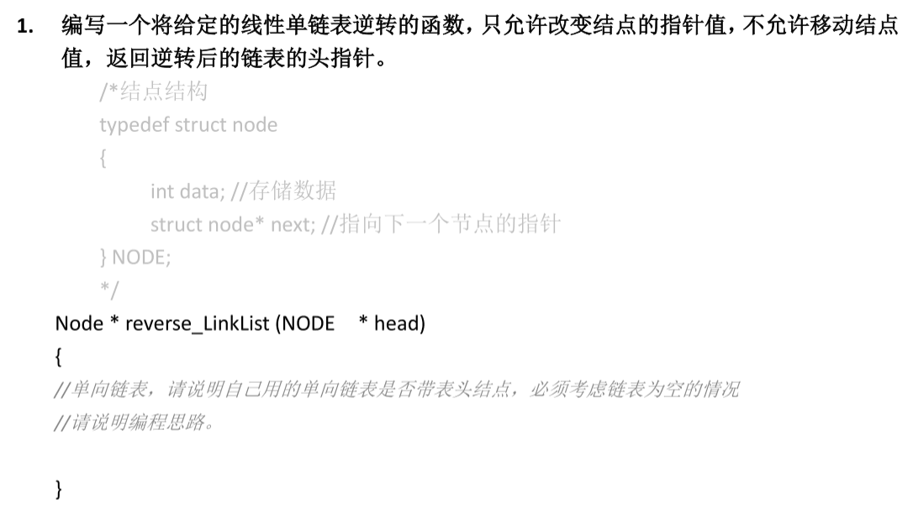
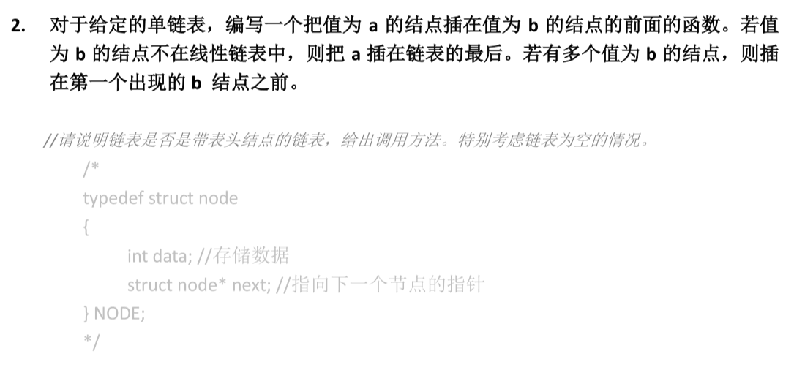
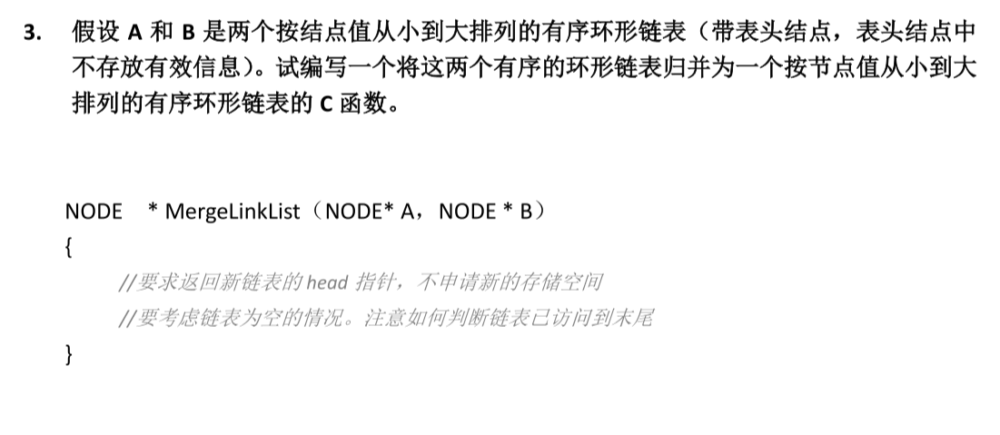
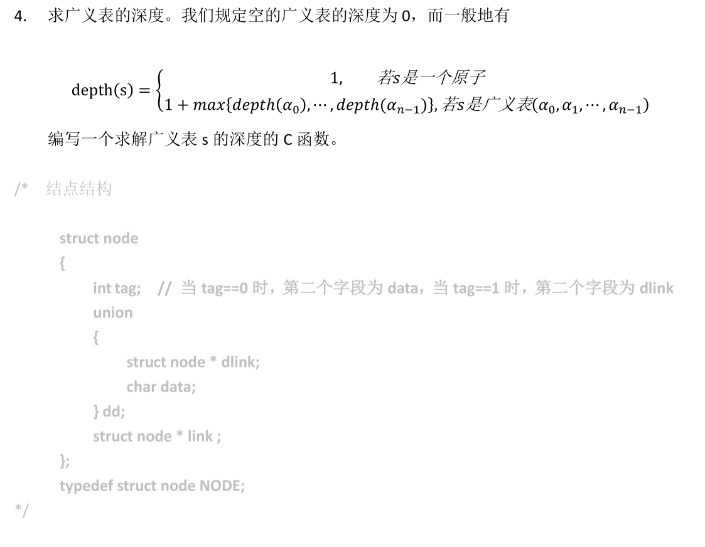
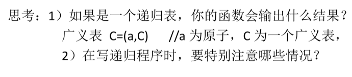

<div align='center'><font size='70'><b>第一次书面作业</b></font></div>

## Q1

### Description



### Solution

附在代码注释中

### code

#### reverse_LinkList

````c++
// 不带表头结点
NODE* reverse_LinkList(NODE *head)
{
    if (head == NULL)   // 链表为空直接返回 
        return head; 
    NODE *p = head;
    int length = 0;     // 计算链表的长度
    while (p != NULL)   
    {
        p = p->next;
        length++;
    }

    if (length == 1)
        return head;
    
    NODE **a;           // 根据链表长度申请空间来开数组
    a = new NODE*[length];
    int i = 0;
    a[i++] = head;
    p = head;
    while (p->next != NULL)   // 用数组记录链表的指针值
    {
        a[i++] = p->next;
        p = p->next;
    }
    NODE *head2 = a[i - 1];     // 利用数组反转整个链表
    i--;
    p = head2;
    while (i - 1 >= 0)
    {
        p->next = a[i - 1];
        p = p->next;
        i--;
    }
    p->next = NULL;     
    delete[] a;         // 销毁申请空间
    return head2;
}

````

## Q2

### Description



### Solution

附在代码注释中

### Code

#### insert

```c++
// 不带表头结点
// 在函数内部申请空间创建新结点
NODE *insert(NODE *head, int a, int key)
{
    NODE *A = new NODE;     // 创建新结点A
    A->data = a;
    A->next = NULL;
    if (head == NULL)       // 如果链表为空，则直接将头指针设为A，返回头指针即可
    {
        head = A;
        return head;
    }

    NODE *p = head;
    if (p->data == key)     // 如果链表第一个结点值即为key值，
    {                       // 则将结点A的指针值设为头指针，再将头指针设为结点A
        A->next = p;
        head = A;
        return head;
    }

    NODE *t = NULL;         // t结点为p结点的父结点
    while (p != NULL && p->data != key)
    {                       // 查找结点值为key的结点，并将其父结点设为t
        t = p;              // 结点值为key的结点可能存在也可能不存在
        p = p->next;        // 无论存在与否，结点t必然存在
    }
    t->next = A;            // 插入结点A
    A->next = p;            
    return head;
}

// 不带表头结点
// 在函数外部申请空间创建新节点
NODE* insert(NODE *head, NODE *a, int key)
{
    if (head == NULL)
    {
        head = a;
        return head;
    }
    NODE *p = head;
    
    if (head->data == key)
    {
        a->next = p;
        head = a;
        return head;
    }

    NODE *t = NULL;
    while (p != NULL && p->data != key)
    {
        t = p;
        p = p->next;
    }
    t->next = a;
    a->next = p;
    return head;
}
```

## Q3

### Description



### Solution

附在代码注释中

### Code

#### mergeLinkList

```c++
// 由于本题不能申请新的内存空间
// 故而新链表主要是改变原先两个链表中的结点的指针值形成的
NODE *mergeLinkList(NODE *a, NODE *b)
{   
    if (a->next == NULL)    // 如果某个链表为空，则直接返回另外一个链表
        return b;
    else if (b->next == NULL)
        return a;

    NODE *p, *q;        // p结点记录a链表遍历到的结点，q结点记录b链表遍历到的结点
    p = a->next;
    q = b->next;

    NODE *m;            // m结点记录新表遍历到的结点
    m = a;
    while (p->next != a->next && q->next != b->next) // 同时遍历a，b链表直到遍历到某个链表的结尾结点
    {
        if (p->data <= q->data) // 如果q结点值大于等于p结点值，则将p结点记录进新表
        {
            m->next = p;
            m = p;
            p = p->next;
        }
        else if (p->data > q->data) // 如果p结点值大于q节点值，则将q结点记录进新表
        {
            m->next = q;
            m = q;
            q = q->next;
        }
        //printf("%d\n", m->data);
    }

    // printf("%d\n", m->data);
    int flag = 0;   // 记录是否处理了最后一个结点
    if (p->next == a->next) // 如果是a链表先遍历到结尾结点
    {
        while (q->next != b->next) // 将b链表剩余的结点记录进新表
        {
            if (flag == 0 && p->data <= q->data) // 处理a链表的结尾结点，将其记录进新表
            {
                m->next = p;
                m = p;
                flag = 1;
            }
            //printf("%d\n", m->data);
            m->next = q;
            m = q;
            q = q->next;
        }
        if (flag == 1) // 如果处理了a链表的结尾结点，则处理b链表的结尾结点
        {
            m->next = q;
            m = q;
        }
    }
    else if (q->next == b->next) // 如果是b链表先遍历到结尾节点
    {
        while (p->next != a->next) // 将a链表剩余的结点记录进新表
        {
            if (flag == 0 && q->data < p->data) // 处理b链表的结尾结点，将其记录进新表
            {
                m->next = q;
                m = q;
                flag = 1;
            }
            m->next = p;
            m = p;
            p = p->next;
        } 
        if (flag == 1) // 如果处理了b链表的结尾结点，则可以处理a链表的结尾结点
        {
            m->next = q;
            m = q;
        }
    }

    if (flag == 0)  // 如果两个结尾结点均没记录进新表，处理最后的两个结点
    {
        if (p->data <= q->data)
        {
            m->next = p;
            m = p;
            m->next = q;
            m = q;
        } else {
            m->next = q;
            m = q;
            m->next = p;
            m = p;
        }
    }
    m->next = a->next; // 处理最后一个结点的指针值，使之成为环形链表
    return a;
}

```

## Q4

### Description



### Solution

附代码注释中

### Code

#### depth

```c++
int depth(NODE *head){
    if (head == NULL) // 如果为空表，返回0
        return 0;

    int MAX = 0;      // 记录该表中元素的深度的最大值
    NODE *p = head;   
    while (p != NULL) // 遍历该表
    {
        if (p->tag == 1)
        {
            if (p->dd.dlink == head) // 如果该表为递归表，则返回-1
                return -1;
            int d = depth(p->dd.dlink); // 记录表中元素的深度

            if (d == -1) // 如果某元素为递归表，则返回-1
                return -1;
            if (d > MAX) 
                MAX = d;
        }
        p = p->link;
    }
    return MAX + 1; 
}
```

### Think Description



#### T1

关于思考一，我的递归函数会输出-1

#### T2

关于思考二，写递归程序主要要注意到递归的边界条件，以及注意针对某些特殊情况，要返回特殊的值
