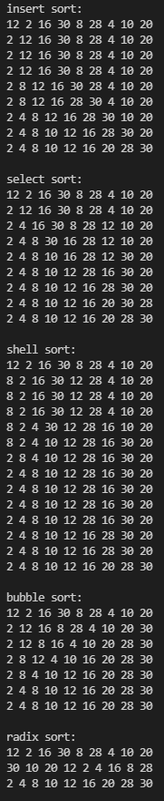
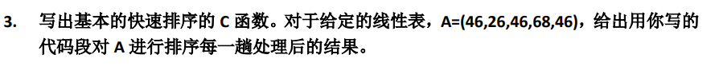

<div><font size="70"><center><b>第三次实验报告</b></center></font></div>

## Q1

### Description


### Solution

跟着写代码就行，

### Code

#### main.cpp

```c++
#include <iostream>
#include <fstream>
using namespace std;

void print(int *a, int len)
{
    for (int i = 0; i < len; i++)
        cout << a[i] << " ";
    cout << endl;
}

void insert_sort(int *a, int len)
{
    int j, key;
    for (int i = 1; i < len; i++)
    {
        j = i - 1;
        key = a[i];
        while (key < a[j] && j >= 0)
        {
            a[j + 1] = a[j];
            j--;
        }
        a[j + 1] = key;
        print(a, len);
    }
}

void swap(int &a, int &b)
{
    int k = a;
    a = b;
    b = k;
}

void select_sort(int *a, int len)
{
    int mini;
    for (int i = 0; i < len - 1; i++)
    {
        mini = i;
        for (int j = i; j < len; j++)
        {
            if (a[j] < a[mini])
                mini = j;
        }
        if (mini != i)
            swap(a[mini], a[i]);
        print(a, len);
    }
}

void shell_sort(int *a, int len)
{
    int delta, i, j, k, key;
    for (delta = 4; delta; delta /= 4)
    {
        for (i = 0; i < delta; i++)
        {
            for (j = i + delta; j < len; j += delta)
            {
                k = j - delta;
                key = a[j];
                while (k >= 0 && a[k] > key)
                {
                    a[k + delta] = a[k];
                    k -= delta;
                }
                a[k + delta] = key;
                print(a, len);
            }
        }
    }
}

void bubble_sort(int *a, int len)
{
    int j, jmax0;
    int jmax = len - 1;
    int flag = 1;
    while (flag != 0)
    {
        flag = 0;
        jmax0 = jmax;
        for (j = 0; j < jmax0; j++)
        {
            if (a[j] > a[j+1])
            {
                swap(a[j], a[j + 1]);
                jmax = j;
                flag = 1;       
            }
        }
        print(a, len);
    }
}

int maxbit(int *a, int len)
{
    int d = 1;
    int p = 10;
    for (int i = 0; i < len; i++)
    {
        while (a[i] >= p)
        {
            p *= 10;
            d++;
        }
    }
    return d;
}

void radix_sort(int *a, int len)
{
    int d = maxbit(a, len);
    int *tmp = new int[len];
    int *count = new int[10];
    int i, j, k;
    int radix = 1;
    for (i = 1; i <= d; i++)
    {
        for (j = 0; j < 10; j++)
            count[j] = 0;

        for (j = 0; j < len; j++)
        {
            k = (a[j] / radix) % 10;
            count[k]++;
        }

        for (j = 1; j < 10; j++)
            count[j] += count[j - 1];

        for (j = len - 1; j >= 0; j--)
        {
            k = (a[j] / radix) % 10;
            tmp[count[k] - 1] = a[j];
            count[k]--;
        }

        for (j = 0; j < len; j++)
            a[j] = tmp[j];

        radix *= 10;
        print(a, len);
    }
    delete[] tmp;
    delete[] count;
}


int main(int argv, char *argc[])
{
    ifstream in(argc[1]);

    int N;
    in >> N;
    int *a_insert = new int[N];
    int *a_select = new int[N];
    int *a_shell = new int[N];
    int *a_bubble = new int[N];
    int *a_radix = new int[N];

    for (int i = 0; i < N; i++)
    {
        in >> a_insert[i];
        a_select[i] = a_shell[i] = a_bubble[i] = a_radix[i] = a_insert[i];
    }

    cout << "insert sort:" << endl;
    print(a_insert, N);
    insert_sort(a_insert, N);
    cout << endl;

    cout << "select sort:" << endl;
    print(a_select, N);
    select_sort(a_select, N);
    cout << endl;

    cout << "shell sort:" << endl;
    print(a_shell, N);
    shell_sort(a_shell, N);
    cout << endl;

    cout << "bubble sort:" << endl;
    print(a_bubble, N);
    bubble_sort(a_bubble, N);
    cout << endl;

    cout << "radix sort:" << endl;
    print(a_radix, N);
    radix_sort(a_radix, N);
    cout << endl;

    delete[] a_insert;
    delete[] a_select;
    delete[] a_shell;
    delete[] a_bubble;
    delete[] a_radix;
}
```

### Result



## Q2

### Description


### Solution

```c++
// select sort
// [5*, 8, 5, 2, 9]
// [2, 8, 5, 5*, 9]
// [2, 5, 8, 5*, 9]
// [2, 5, 5*, 8, 9]

// shell sort
// [2, 1*, 1, 2]
// [1, 1*, 2, 2]

// quick sort
// 选取中间值作为比较的key值，大于等于key值放左边
// [3*, 3, 1]
// [1, 3, 3*]
```

## Q3

### Description



### Solution

取中间值作为比较的基准值

大于等于基准值的值放右边，小于基准值的放左边

### Code

#### main.cpp

```c++
#include <iostream>
#include <fstream>
#include <algorithm>
using namespace std;

int N = 0;

void print(int *a, int len)
{
    for (int i = 0; i < len; i++)
        cout << a[i] << " ";
    cout << endl;
}

void quick_sort(int *a, int left, int right)
{
    if (left >= right)
        return;
    int low = left, up = right;
    swap(a[left], a[(left + right) / 2]);
    int key = a[low];
    while (low < up)
    {
        while (a[up] >= key && up > low)
            up--;
        if (up > low)
            a[low++] = a[up];
        while (a[low] < key && low < up)
            low++;
        if (up > low)
            a[up--] = a[low];
    }
    a[low] = key;
    print(a, N);

    quick_sort(a, left, low - 1);
    quick_sort(a, low + 1, right);
}

int main(int argv, char *argc[])
{
    ifstream in(argc[1]);
    in >> N;
    int *a = new int[N];
    for (int i = 0; i < N; i++)
        in >> a[i];
    print(a, N);    
    quick_sort(a, 0, N - 1);

}
```

### Result


## Q4(selective)

### Description


### Solution

可以用三路快排，即选取基准值之后，

小于基准值的放左边一路，大于基准值的放右边一路，等于基准值的放中间一路

### Code

```c++
#include <iostream>
#include <fstream>
#include <algorithm>
using namespace std;

int N = 0;

void print(int *a, int len)
{
    for (int i = 0; i < len; i++)
        cout << a[i] << " ";
    cout << endl;
}

void quick3sort(int *a, int left, int right)
{
    if (left >= right)
        return;

    int i = 0;
    int mid = (left + right) / 2;
    int low = left, up = right;
    int lowt = left;
    swap(a[left], a[mid]);
    
    printf("%d:a[%d](%d)<->a[%d](%d)\n", i++, left, a[left], (left + right) / 2, a[(left + right) / 2]);
    
    int key = a[left];
    while (low <= up)
    {
        if (a[low] < key)
        {
            swap(a[lowt++], a[low++]);
            
            printf("%d:a[%d](%d)<->a[%d](%d)\n", i++, lowt-1, a[low-1], low-1, a[lowt-1]);
            
        }
        else if (a[low] > key)
        {
            swap(a[low], a[up--]);
            
            printf("%d:a[%d](%d)<->a[%d](%d)\n", i++, low, a[up+1], up+1, a[low]);
            
        }
            
        else
            low++;
    }

    cout << endl;
    //cout << lowt << " " << up+1 << endl;
    print(a, N);
    cout << endl;
    
    quick3sort(a, left, lowt - 1);
    quick3sort(a, up + 1, right);
}

int main(int argv, char *argc[])
{
    ifstream in(argc[1]);
    in >> N;
    int *a = new int[N];
    for (int i = 0; i < N; i++)
        in >> a[i];
    print(a, N);
    printf("\n");
    quick3sort(a, 0, N - 1);
}
```

### Result


### Analysis

改进之处在于对于重复的元素不再进行排序，而是将重复的元素归为一路后，对另外两路进行快排，即减少了重复元素移动的开销。

