<div align='center' ><font size='70'><b>Lab01</b></font></div>

## Q1

### Description

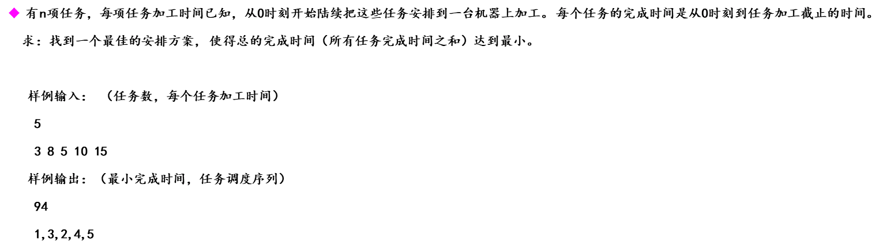

### Solution

最简单的贪心了

### Code

#### lab1-1.cpp

```c++
#include <iostream>
#include <algorithm>
using namespace std;

const int MAXN = 1e5;
struct TASK{
    int No;
    int time;
};

TASK task[MAXN];

bool compare_task(const TASK& elem1, const TASK& elem2)
{
    return elem1.time < elem2.time;
}

int main() 
{
    int Tnum;
    scanf("%d\n", &Tnum);
    for (int i = 0; i < Tnum; i++)
    {
        task[i].No = i + 1;
        scanf("%d", &task[i].time);
    }
    sort(task, task + Tnum, compare_task);
    int timesum = 0;
    int T = Tnum;
    for (int i = 0; i < Tnum; i++)
    {
        timesum += T * task[i].time;
        T--;
    }
    printf("%d\n", timesum);
    for (int i = 0; i < Tnum-1; i++)
    {
        printf("%d ", task[i].No);
    }
    printf("%d\n", task[Tnum - 1].No);
    return 0;
}
```


## Q2

### Description

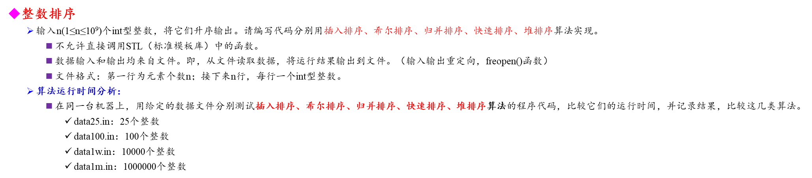

### Solution

直接上网查排序算法开抄

### Code

#### mysort.h

```c++
#ifndef MYSORT_H
#define MYSORT_H

void my_insert_sort(int *a, int num);
void my_shell_sort(int *a, int num);
void my_merge_sort(int *a, int start, int end);
void my_quick_sort(int *a, int left, int right);
void my_heap_sort(int *a, int num);

#endif
```

#### main.cpp

```c++
#include <iostream>
#include <ctime>
#include "mysort.h"
#include <fstream>
using namespace std;

int main(int argc, char *argv[])
{
    int length;
    ifstream in(argv[1]);
    ofstream out(argv[2]);
    // int wrong;
    // scanf("%d\n", &wrong);

    // scanf("%d\n", &length);
    // printf("%d\n", length);
    in >> length;
    int *a = new int[length];


    int *a_shell = new int[length];
    int *a_merge = new int[length];
    int *a_quick = new int[length];
    int *a_heap = new int[length];
    int i = 0;
    while(i < length && in >> a[i])
    {
        // printf("%d\n", a[i]);
        a_shell[i] = a_merge[i] = a_quick[i] = a_heap[i] = a[i];
        // printf("%d %d\n", a[i], a_merge[i]);
        i++;
    }
    // printf("你好！\n");
    // int k = 1;
    // printf("%d\n", k);
    clock_t start, end;

    // 插入排序
    start = clock();
    my_insert_sort(a, length);
    end = clock();
    // for (int i = 0; i < length; i++)
    //     out << a[i] << endl;
    printf("插入排序用时：%fs\n", (double)(end - start) / CLOCKS_PER_SEC);
    

    //希尔排序
    // for (int i = 0; i < length; i++)
    //     printf("%d\n", a_shell[i]);
    start = clock();
    my_shell_sort(a_shell, length);
    end = clock();
    for (int i = 0; i < length; i++)
        out << a_shell[i] << endl;
    printf("希尔排序用时：%fs\n", (double)(end - start) / CLOCKS_PER_SEC);
    

    //归并排序
    start = clock();
    my_merge_sort(a_merge, 0, length-1);
    end = clock();
    // for (int i = 0; i < length; i++)
    //     cout << a_merge[i] << endl;
    printf("归并排序用时：%fs\n", (double)(end - start) / CLOCKS_PER_SEC);
    

    //快速排序
    start = clock();
    my_quick_sort(a_quick, 0, length-1);
    end = clock();
    // for (int i = 0; i < length; i++)
    //     cout << a_quick[i] << endl;
    printf("快速排序用时：%fs\n", (double)(end - start) / CLOCKS_PER_SEC);
    
    //堆排序
    start = clock();
    my_heap_sort(a_heap, length);
    end = clock();
    // for (int i = 0; i < length; i++)
    //     cout << a_heap[i] << endl;
    printf("堆排序用时：%fs\n", (double)(end - start) / CLOCKS_PER_SEC);


    // for (int i = 0; i < length; i++)
    // {
    //     // if (!(a[i] == a_shell[i]))
    //     //     printf("wrong1!\n");
    //     if (!(a_merge[i] == a_shell[i]))
    //         printf("wrong2!\n");
    //     if (!(a_merge[i] == a_quick[i]))
    //         printf("wrong3!\n");
    //     if (!(a_quick[i] == a_heap[i]))
    //         printf("wrong4!\n");
    // }

    in.close();
    out.close();
    delete[] a;
    delete[] a_shell;
    delete[] a_merge;
    delete[] a_quick;
    delete[] a_heap;
}
```

#### mysort.cpp

```c++
#include <iostream>
#include "mysort.h"

void my_insert_sort(int *a, int num)
{
    for (int i = 1; i < num; i++)
    {
        int key = a[i];
        int j = i - 1;
        while (a[j] > key && j >= 0)
        {
            a[j + 1] = a[j];
            j--;
        }
        a[j + 1] = key;
    }
}

void my_shell_sort(int *a, int num)
{
    for (int delta = num; delta; delta /= 2)
    {
        for (int i = 0; i < delta; i++)
        {
            for (int j = i + delta; j < num; j += delta)
            {
                int key = a[j];
                int k = j - delta;
                while (k >= 0 && a[k] > key)
                {
                    a[k + delta] = a[k];
                    k -= delta;
                }
                a[k + delta] = key;
            }
        }
    }
}

void merge(int *a, int start, int mid, int end)
{
    int len = end - start + 1;
    int *b = new int[len];
    int i = start, j = mid + 1, k = 0;
    while (i < mid + 1 && j < end + 1)
    {
        if (a[i] > a[j])
            b[k++] = a[j++];
        else
            b[k++] = a[i++];
    }
    while (i < mid + 1)
        b[k++] = a[i++];
    while (j < end + 1)
        b[k++] = a[j++];
    for (int i = start; i <= end; i++)
    {
        a[i] = b[i - start];
    }
}

void my_merge_sort(int *a, int start, int end)
{
    if (start >= end)
        return;
    int mid = (start + end) / 2;
    my_merge_sort(a, start, mid);
    my_merge_sort(a, mid + 1, end);
    merge(a, start, mid, end);
}

void swap(int *a, int i, int j)
{
    int key = a[i];
    a[i] = a[j];
    a[j] = key;
}

void my_quick_sort(int *a, int left, int right)
{
    if (left >= right)
        return;
    int mid = (left + right) / 2;
    swap(a, left, mid);
    int last = left;
    for (int i = left + 1; i <= right; i++)
    {
        if (a[i] < a[left])
            swap(a, ++last, i);
    }
    swap(a, last, left);
    my_quick_sort(a, left, last);
    my_quick_sort(a, last + 1, right);
}

void swap(int &a, int &b)
{
    int key = a;
    a = b;
    b = key;
}

void max_heapify(int *a, int start, int end)
{
    int dad = start;
    int son = start * 2 + 1;
    while (son <= end)
    {
        if (son + 1 <= end && a[son] < a[son+1])
            son++;
        if (a[dad] > a[son])
            return;
        else
        {
            swap(a, dad, son);
            dad = son;
            son = dad * 2 + 1;
        }
    }
}

void my_heap_sort(int *a, int num)
{
    for (int i = num / 2 - 1; i >= 0; i--)
        max_heapify(a, i, num - 1);
    for (int i = num - 1; i > 0; i--)
    {
        swap(a[0], a[i]);
        max_heapify(a, 0, i - 1);
    }
}
```

### Result

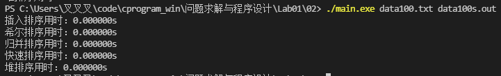

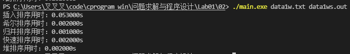

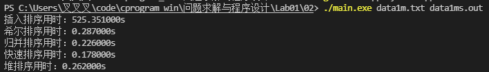


### Result Analysis

| 排序算法 | 时间复杂度（平均情况） |
| :------: | :--------------------: |
| 插入排序 |    O(n<sup>2</sup>)    |
| 希尔排序 |   O(n<sup>1.3</sup>)   |
| 归并排序 |  O(nlog<sub>2</sub>n)  |
| 快速排序 |  O(nlog<sub>2</sub>n)  |
|  堆排序  |  O(nlog<sub>2</sub>n)  |


## Q3

### Description


### Solution

还行，跟着题给网址中java写的类仿写就行，同时实现并查集，取随机时要注意一下

##### P.S

随机开一块板砖有两种写法

第一种用一个简单的while循环，直到选中没开启的板砖再做打开操作

第二种则是另开一个数组存储没打开的板砖编号，随机选取打开后，将打开的板砖从这个数组中删去

由于C语言伪随机数的特性，用第一种方法会在N >= 182时程序跑不出来，而第二种则没有这个bug

### Code

#### percolation_model.h

```c++
#ifndef PERCOLATION_MODEL_H
#define PERCOLATION_MODEL_H
// #include <set>
#include <vector>

class percolation_model{
private:
    int N;
    int *a;
    int cnt; // 打开板砖个数
    // std::set<int> locked_num{};
    std::vector<int> locked_num{};
    // int *locked_num;
    // int locked_length;

    int *id;
    int *sz;

public:
    percolation_model(int);
    ~percolation_model();
    // 并查集操作
    int find(int);
    void weigh_QU(int, int);
    
    void switch_rand(); // 随机打开一块板砖
    int percolation_if();  // 判断是否渗漏
    int cnt_num();  // 概率计算
    void print_model(); // 打印模型

    void print_sets();
    void path_compression();
    void path_print(int);
    struct illegal_types{
    };
};
#endif
```

#### main.cpp

```c++
#include <iostream>
#include <cstdlib>
#include <ctime>
#include "percolation_model.h"
// #define random(x) rand()%(x)
using namespace std;

// int N;
// // a实际模型，id、sz是基于模型的并查集
// void init(int N, int *a, int *id, int *sz)
// {
//     int *a = new int[N * N];
//     for (int i = 0; i < N * N; i++)
//     {
//         a[i] = 0;
//         id[i] = i;
//         sz[i] = 0;
//     }
// }

// int find(int p, int *id)
// {
//     while (p != id[p])
//     {
//         p = id[p];
//     }
//     // if (pGSon != -1)
//     // {
//     //     if (sz == sz[p])
//     //     {
//     //         id[pGSon] = p;
//     //         sz[p]
//     //     }
//     // }
//     return p;
// }

// void weigh-QU(int p, int q, int *sz, int *id)
// {
//     int qRoot = find(q, id);
//     int pRoot = find(p, id);
//     if (qRoot == pRoot)
//         return;
//     if (sz[pRoot] == sz[qRoot])
//     {
//         id[q] = pRoot;
//         sz[pRoot]++;
//     } else if (sz[pRoot] < sz[qRoot])
//     {
//         id[p] = qRoot;
//     } else {
//         id[q] = pRoot;
//     }
// }

// void switch_rand(int *a, int N, int &cnt, int *id, int *sz)
// {
//     srand((int)time(0));
//     int z = rand() % (N * N);
//     if (a[z] != 1)
//     {
//         a[z] = 1;
//     } else {
//         while (a[z] == 1)
//         {
//             z = rand() % (N * N);
//         }
//         a[z] = 1;
//     }
//     cnt++;
//     // 并查集合并
//     if (z - 1 >= 0 && )
//     {}
//         return;
// }

// int percolation_if(int N, int *a, int *id)
// {
//     int pRoot, qRoot;
//     for (int i = 0; i < N; i++)
//         for (int j = 0; j < N; j++)
//         {
//             pRoot = find(i, id);
//             qRoot = find(N * (N - 1) + j, id);
//             if (pRoot == qRoot)
//                 return 1;
//         }
//     return 0;
// }

int main()
{
    srand((unsigned)time(0));
    clock_t start, end;
    int N;
    cout << "请输入N：";
    cin >> N;
    cout << "请输入测试次数：";
    int times;
    int ci = 0;
    cin >> times;
    // int k = 0;
    // 并查集问题
    double p_m = 0.0;
    long cnt_sum = 0;
    start = clock();
    int it = 0;
    while(it < times)
    {
        percolation_model pm(N);
        while (!pm.percolation_if())
        {
            pm.switch_rand();
            //printf("\n");
            //k++;
        }
        // p_m = (p_m * ci + (double)pm.cnt_num() / (N * N)) / (ci + 1);
        // ci++;
        cnt_sum += pm.cnt_num();
        it++;
    }
    //cout << cnt_sum << endl;
    p_m = (double)cnt_sum / (long)(N * N * times) * 100;
    end = clock();
    //printf("%d\n", k);
    //printf("%d\n", pm.cnt_num());
    cout << p_m << endl;
    // pm.print_model();
    printf("花费时间：%fs\n", (double)(end-start)/CLOCKS_PER_SEC);
    // pm.path_compression();
    // pm.print_sets();
    return 0;
}
```

#### percolation_model.cpp

```c++
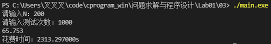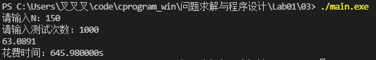#include <iostream>
#include <ctime>
#include <cstdlib>
#include "percolation_model.h"
using namespace std;

int dx[4] = {-1, 0, 1, 0 };
int dy[4] = { 0, -1, 0, 1 };

percolation_model::percolation_model(int num)
{
    N = num;
    a = new int[N * N];
    cnt = 0;
    id = new int[N * N];
    sz = new int[N * N];
    // locked_num = new int[N * N];
    // locked_length = N * N;
    for (int i = 0; i < N * N; i++)
    {
        a[i] = 0;
        id[i] = i;
        sz[i] = 0;
        locked_num.push_back(i);
        // locked_num[i] = i;
    }
}

percolation_model::~percolation_model()
{
    delete[] a, id, sz;
}

int percolation_model::find(int p)
{
    while (p != id[p])
        p = id[p];
    return p;
}

void percolation_model::weigh_QU(int p, int q)
{
    int qRoot = find(q);
    int pRoot = find(p);
    if (qRoot == pRoot)
        return;
    if (sz[pRoot] == sz[qRoot])
    {
        id[qRoot] = pRoot;
        sz[pRoot]++;
    } else if (sz[pRoot] < sz[qRoot])
    {
        id[pRoot] = qRoot;
    } else {
        id[qRoot] = pRoot;
    }
}

void percolation_model::switch_rand()
{
    //srand((int)time(0));

    int num = locked_num.size();
    if (num == 0)
        return;
    int zi = rand() % num;
    int z = locked_num[zi];
    locked_num.erase(locked_num.begin() + zi);
    
    // for (int i = zi; i < locked_length; i++)
    // {
    //     locked_num[i] = locked_num[i + 1];
    // }
    // locked_length--;
    // int z = rand() % (N * N);
    // while (a[z] == 1)
    // {
    //     //srand((int)time(0));
    //     z = rand() % (N * N);
    // }
    a[z] = 1;
    cnt++;
    int col, row;
    row = z / N;
    col = z % N;
    int x, y;
    for (int i = 0; i < 4; i++)
    {
        x = col + dx[i];
        y = row + dy[i];
        if (x >= 0 && x < N && y >= 0 && y < N && a[y * N + x] == 1)
        {
            weigh_QU(z, y * N + x);
        }

    }

        // 并查集合并
        // if (z % N == 0)
        // {
        //     if (z - N >= 0 && id[z - N] == 1)
        //     {
        //         weigh_QU(z - N, z);
        //     }
        //     if (z + N < N * N && id[z + N] == 1)
        //     {
        //         weigh_QU(z + N, z);
        //     }
        //     if (z + 1)
        // }

    return;
}

int percolation_model::percolation_if()
{
    int pRoot, qRoot;
    for (int i = 0; i < N; i++)
    {
        if (a[i])
        {
            for (int j = 0; j < N; j++) // 优化
            {
                if (a[N * (N - 1) + j])
                {
                    pRoot = find(i);
                    qRoot = find(N * (N - 1) + j);
                    //printf("%d %d\n", pRoot, qRoot);
                    if (pRoot == qRoot)
                    {
                        //printf("%d %d %d\n", i, j, pRoot);
                        path_print(pRoot);
                        return 1;
                    }
                }
            }
        }
    }
    return 0;
}

int percolation_model::cnt_num()
{
    return cnt;
}

void percolation_model::print_model()
{
    for (int i = 0; i < N; i++)
    {
        for (int j = 0; j < N; j++)
            printf("%d ", a[i * N + j]);
        printf("\n");
    }
}

void percolation_model::print_sets()
{
    for (int i = 0; i < N; i++)
    {
        for (int j = 0; j < N; j++)
            printf("%2d ", id[i * N + j]);
        printf("\n");
    }
}

void percolation_model::path_compression()
{
    for (int i = 0; i < N * N; i++)
    {
        int iRoot = find(i);
        id[i] = iRoot;
    }
}

void percolation_model::path_print(int k)
{
    for (int i = 0; i < N * N; i++)
    {
        int root = find(i);
        if (root == k)
            a[i] = 2;
    }
}
```

### Result

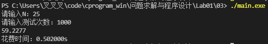

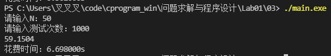

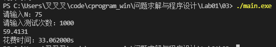

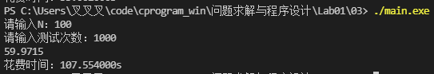


### Result Analysis

从测试数据来看，随着N的增大，p*是在逐渐增大的。

这个结果其实还是比较符合生活常识带给我们的直觉的，随着N的增大，渗透的阻力其实也在增大，亦即渗透遇到的障碍会变多，故而p*是会增大的。