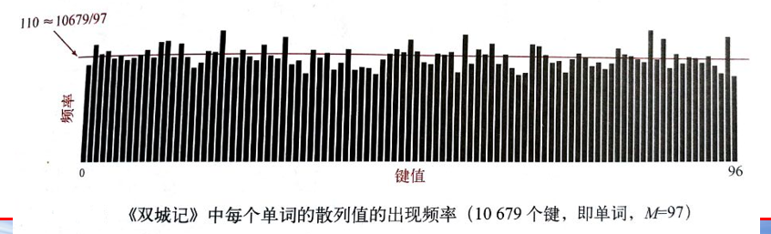
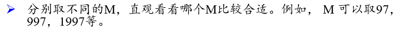
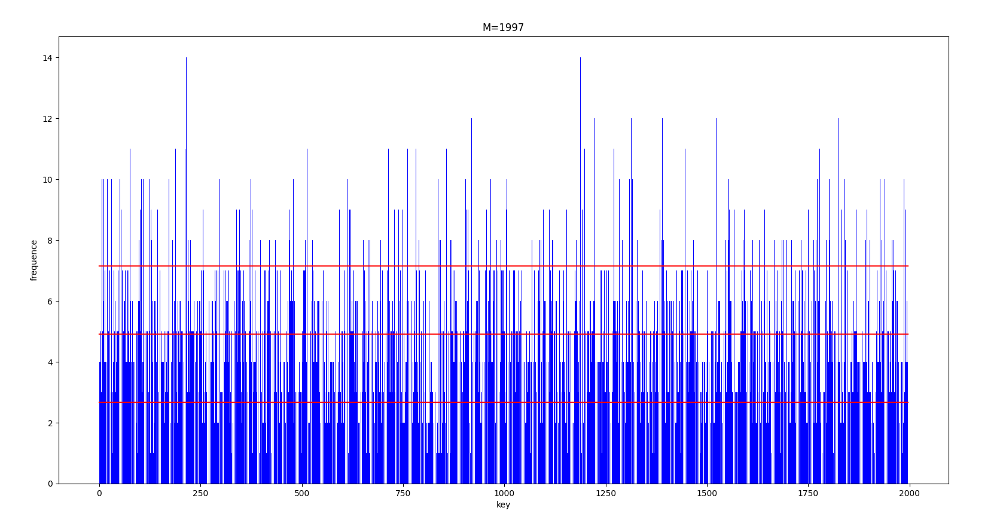
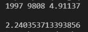
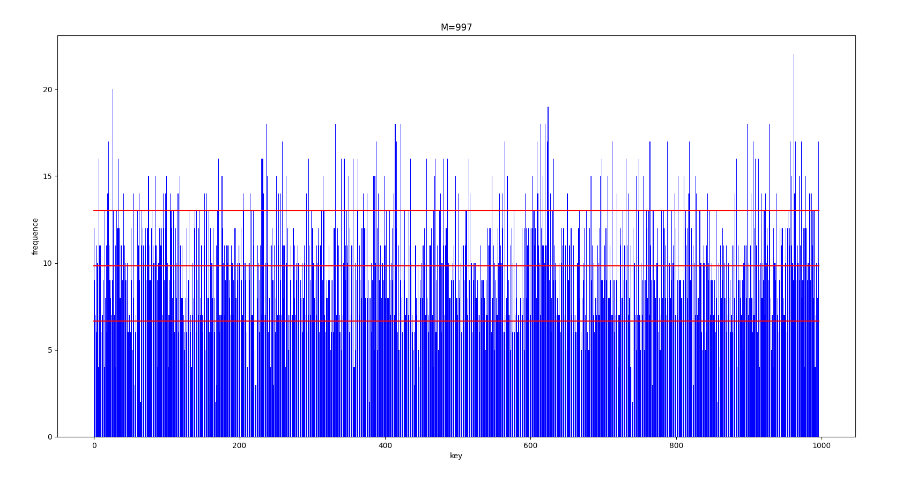
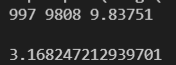
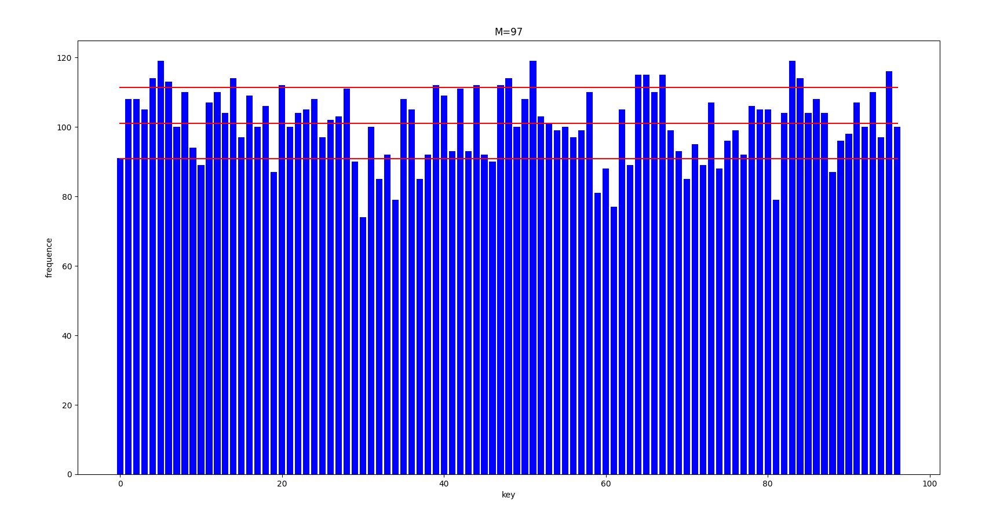
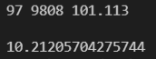
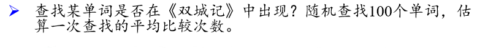
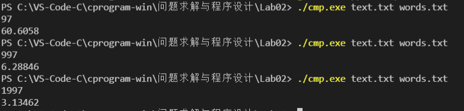

<div><font size='70'><center><b>第二次实验报告</b></center></font></div>

## Description


## Request1


### Solution

先设计一个文字预处理程序，将双城记中的单词剥离出来，导出到text.txt文件

```powershell
./pre-processing.exe A Tale of Two Cities - Charles Dickens.txt text.txt
```

再用main程序对导出的text.txt进行处理，输入M值，进而导出不同的result文件，

main程序命令如下(M在main程序启动后输入)

```powershell
./main.exe text.txt result.txt
```

### Code

#### pre-processing.cpp

```c++
#include <iostream>
#include <fstream>
using namespace std;

// 为了方便我自己写的挺随意的，所有是符号的地方我都当成空格，
bool is_word(char a)
{
    if ((a >= 'a' && a <= 'z') || (a >= 'A' && a <= 'Z'))
        return true;
    return false;
}

char toLower(char a)
{
    if (a >= 'A' && a <= 'Z')
        a -= 'A' - 'a';
    return a;
}

int main()
{
    ifstream in("A Tale of Two Cities - Charles Dickens.txt");
    ofstream out("text2.txt");
    char a;
    while (in.get(a))
    {
        if (is_word(a))
        {
            //a = toLower(a);
            out << a;
            while (in.get(a) && is_word(a))
            {
                //a = toLower(a);
                out << a;
            }
            out << endl;
        }
    }
}
```

#### myHash.h

```c++
#ifndef MYHASH_H
#define MYHASH_H
#include <list>
#include <string>
using namespace std;

class myHash{
private:
    list<string> *base;
    int *list_len;
    int length;
    int num;
public:
    myHash(int);
    ~myHash();
    int index(string);
    bool search(string);
    void insert(string);
    void remove(string);

    double loadFactor();
    int wordsNum();
    int *lenNum();
};

myHash::myHash(int N)
{
    length = N;
    base = new list<string>[length];
    list_len = new int[length];
    for (int i = 0; i < length; i++)
    {
        list_len[i] = 0;
    }
    num = 0;
}

myHash::~myHash()
{
    delete[] base;
    delete[] list_len;
}

int myHash::index(string st) // 计算hash值
{
    int id = 0;
    for (int i = 0; i < (int)st.size(); i++)
    {
        id = (id * 128 + st[i]) % length;
    }
    return id;
}

bool myHash::search(string st)
{
    int ind = index(st);
    list<string>::iterator it;
    for (it = base[ind].begin(); it != base[ind].end(); it++)
    {
        if (*it == st)
            return true;
    }
    return false;
}

void myHash::insert(string st) // 和search会有冗余操作
{
    if (this->search(st)) 
        return;
    int ind = index(st);
    base[ind].push_back(st);
    num++;
    list_len[ind]++;
}

void myHash::remove(string st)
{
    int ind = index(st);
    base[ind].remove(st);
    num--;
    list_len[ind]--;
}

int myHash::wordsNum()
{
    return num;
}

double myHash::loadFactor()
{
    return num * 1.0 / length;
}

int* myHash::lenNum()
{
    return list_len;
}

#endif
```

#### main.cpp

```c++
#include <iostream>
#include <fstream>
#include <list>
#include <string>
#include "myHash.h"
using namespace std;

int main(int argv, char *argc[])
{
    ifstream in(argc[1]);
    ofstream out(argc[2]);
    int M;
    cin >> M;
    myHash HT(M);
    string st;
    while (in >> st)
    {
        if (HT.search(st))
            continue;
        HT.insert(st);
    }
    out << M << " " << HT.wordsNum() << " " << HT.loadFactor() << endl;
    int *k;
    k = HT.lenNum();
    for (int i = 0; i < M; i++)
        out << k[i] << endl;
    // out << HT.wordsNum() << endl;
    // out << HT.loadFactor() << endl;
}
```

## Request2




### Solution

利用python的matplotlib.pyplot库进行画图(写的比较随意，不像C++去定义各种函数了)

### Code

```python
import numpy as np
import matplotlib.pyplot as plt

result1 = open("result.txt")
head = result1.readline()
headlist = head.split(' ')
nums = result1.readlines()
numList = []


for i in range(len(nums)):
    numList.append(int(nums[i]))
mean = np.mean(numList)
stdv = np.std(numList)


plt.figure()
plt.bar(range(len(numList)), numList, fc='b')
plt.plot(range(len(numList)), [mean]*len(numList), color='r', lineStyle='-')
plt.plot(range(len(numList)), [mean - stdv]*len(numList), color='r', lineStyle='-')
plt.plot(range(len(numList)), [mean + stdv]*len(numList), color='r', lineStyle='-')
plt.title("M=" + headlist[0])
plt.xlabel("key")
plt.ylabel("frequence")
plt.show()
# plt.

# print(num1)
# # head2list = head2.split('\n')
# # print(head2list)
# print(headlist)
print(head)
print(stdv)
```

## Request3



### Solution

利用request2的程序进行画图，中间的横线是平均数，上下两条则分别是加减标准差之后的横线

下面命令行输出的数据依次是，M，单词数，平均值，标准差

### Result





​	







### Analysis

就我直观而言，还是M=97看的平均一点

## Request4



### Solution

查找单词是否存在已有search函数，但是不便于返回比较次数，故另外定义search2函数并且其返回值为比较次数

修改一下myHash.h以及main.cpp的程序来计算一次查找的平均比较次数。

为了与前面的main.exe做出区分，本次编译及执行的命令如下：

```powershell
g++ main.cpp -o cmp.exe
./cmp.exe text.txt words.txt
```

### Code

#### myHash.h

```c++
// myHash类中添加一个search2函数，返回值为比较次数
int myHash::search2()
{
    int ind = index(st);
    list<string>::iterator it;
    for (it = base[ind].begin(); it != base[ind].end(); it++)
    {
        if (*it == st)
            return it - base[ind].begin() + 1;
    }
    return base[ind].end() - base[ind].begin();
}
```

#### main.cpp

```c++
#include <iostream>
#include <fstream>
#include <list>
#include <string>
#include "myHash.h"
using namespace std;

int main(int argv, char *argc[])
{
    ifstream in(argc[1]);
    // ofstream out(argc[2]);
    ifstream words(argc[2]);
    int M;
    cin >> M;
    myHash HT(M);
    string st;
    while (in >> st)
    {
        if (HT.search(st))
            continue;
        HT.insert(st);
    }
    // out << M << " " << HT.wordsNum() << " " << HT.loadFactor() << endl;
    // int *k;
    // k = HT.lenNum();
    // for (int i = 0; i < M; i++)
    //     out << k[i] << endl;
    // out << HT.wordsNum() << endl;
    // out << HT.loadFactor() << endl;
    int cmp = 0;
    int len = 0;
    while (words >> st)
    {
        cmp += HT.search2(st);
        len++;
    }
    cout << cmp * 1.0 / len << endl;
}
```

### Result

结果如下所示（第一个是M，第二个是平均比较次数）


