<div><font size='70'><center><b>第三次报告</b></center></font></div>

## Description

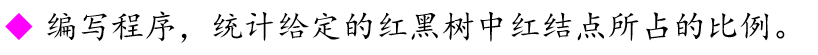

## Readme

红黑树的代码写的太长，放在最后了，前面只放相关需求的代码

本次报告主要是对着教程写红黑树（还是不懂删除结点的相关操作hhhh）

本实验对每个N都随机建了1000棵树，并将结果放在result文件里，

并且对结果进行了可视化

主要是两条命令

编译：

```powershell
g++ main.cpp -o main.exe
```

执行：(N是随机生成的关键字个数，M是随机测试次数)

```powershell
./main.exe result N M
```

## Request1

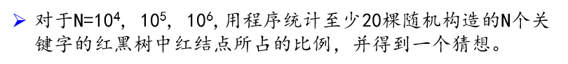

### Solution

需要注意的是，nil结点是要算成黑结点的，根据

<center><b>n<sub>0</sub>=n<sub>2</sub>+1</b></center>

可知，当总共的节点个数为 2*N + 1， 故红节点比例为

<center><b> R = N<sub>红</sub> / (2 * N + 1)</b></center>

### Code

#### RedNum

```C++
// 用了层序遍历
int RBTree::RedNum()
{
    std::queue<NODE *> que;
    if (root != NULL)
        que.push(root);

    NODE *p;
    int rn = 0;
    while (!que.empty())
    {
        p = que.front();
        que.pop();
        if (p->isRed == true)
            rn++;
        if (p->lchild != NULL)
            que.push(p->lchild);
        if (p->rchild != NULL)
            que.push(p->rchild);
    }
    return rn;
}
```

### Result

#### PS：红线为平均数线

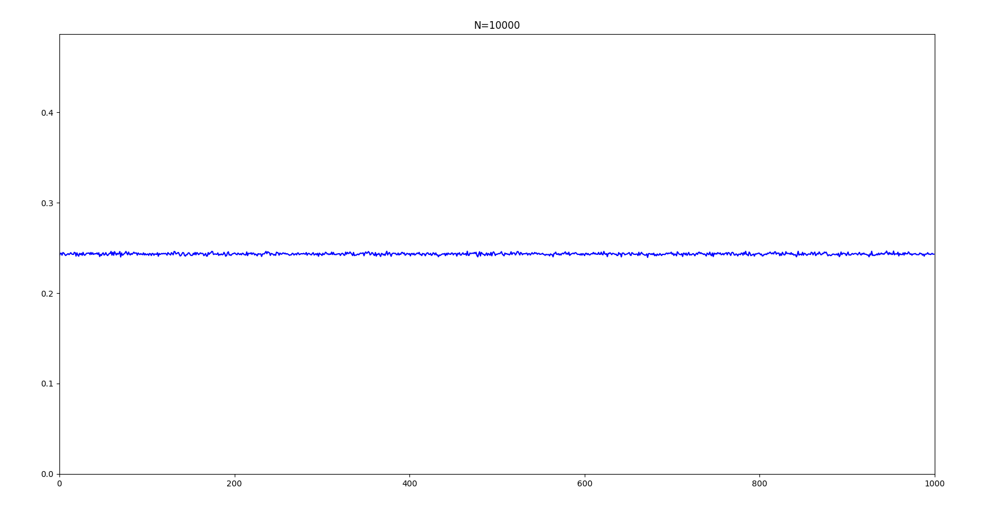

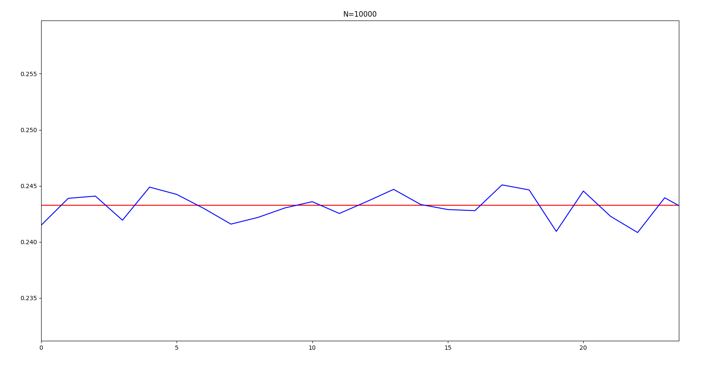

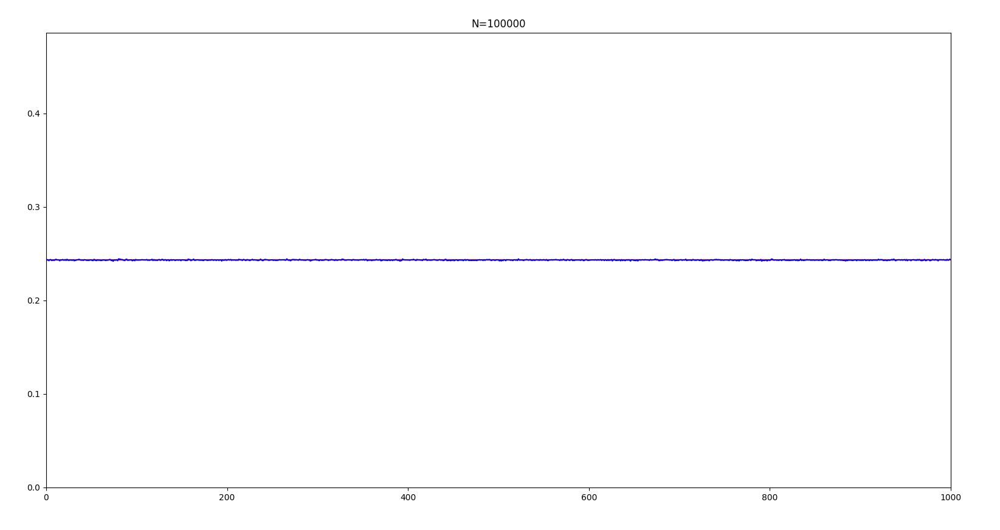

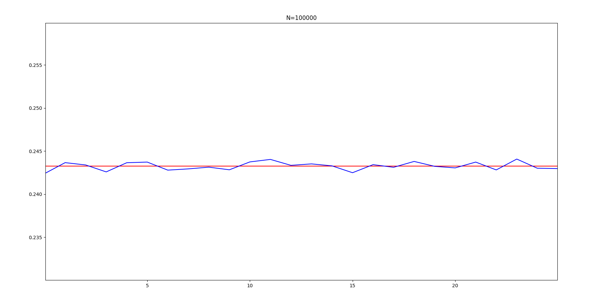

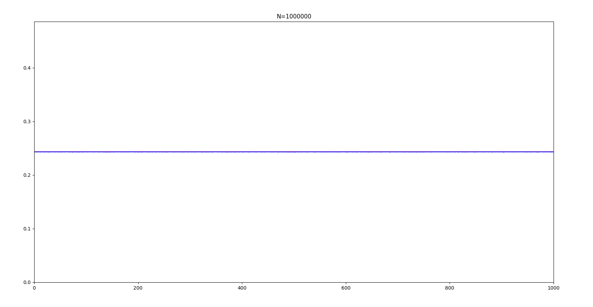

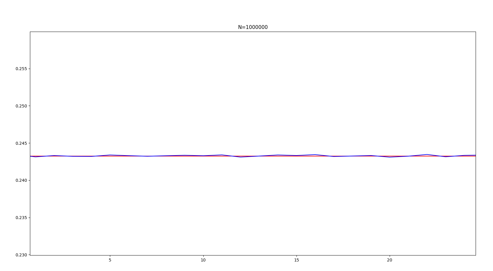

### 猜想

由上述图片直观可得，随着N增大，红结点的比例是趋于一个特定的比例的，我的计算结果是

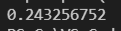

即随着N增大，红结点的比例将会趋于上述的固定常数

## Request2


### Code

#### depth

```c++
int depth(NODE* t)
{
    if (t == NULL)
        return 0;

    int d1 = depth(t->lchild);
    int d2 = depth(t->rchild);
    int max = d1 > d2 ? d1 : d2;

    return 1 + max;
}
```

### Result

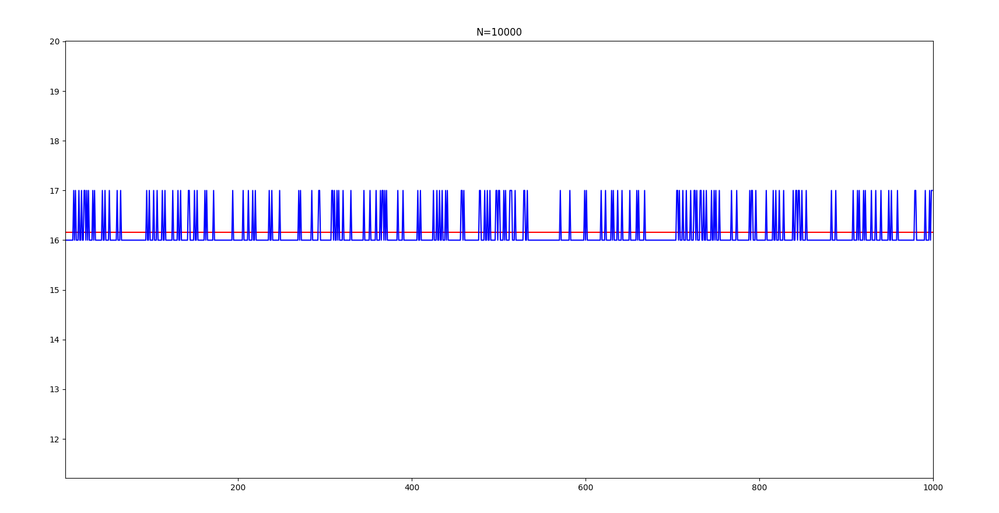

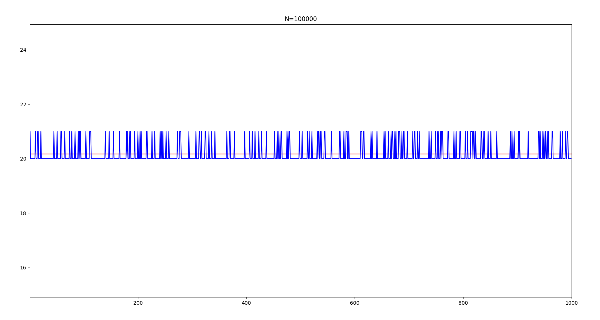

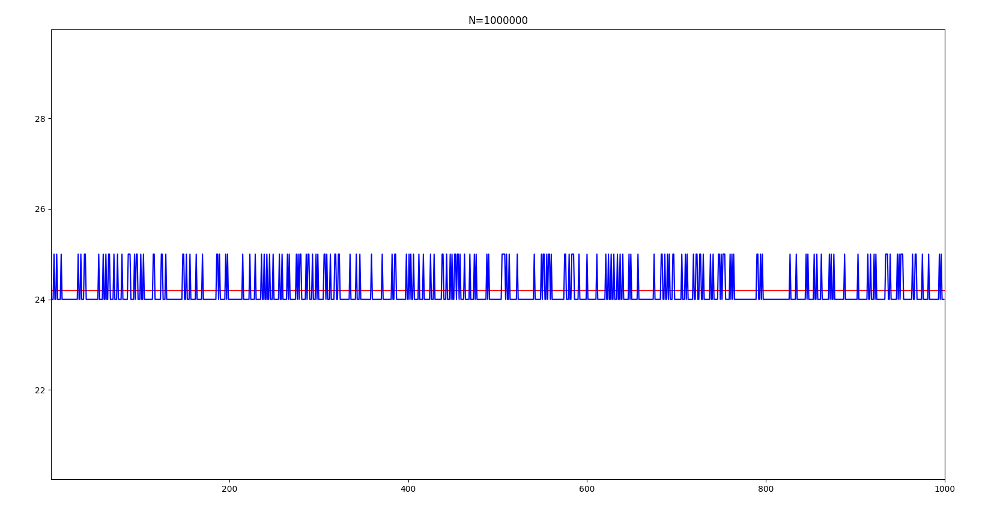

### 结论

对上述图表进行分析，可以发现，

|    N    |       树高       |
| :-----: | :--------------: |
|  10000  | 16（频率高）或17 |
| 100000  | 20（频率高）或21 |
| 1000000 | 24（频率高）或25 |

可以得出，N每增加一个数量级，树高就增加4

## Code

### main.cpp

```c++
#include <iostream>
#include "RBtree.h"
#include <cstdlib>
#include <ctime>
#include <fstream>
using namespace std;

int main(int argc, char *argv[])
{
    srand(unsigned(time(0)));
    ofstream out(argv[1]);
    int N = atoi(argv[2]);
    int M = atoi(argv[3]);
    out << N << " " << M << endl;
    int im = 0;
    while (im < M)
    {
        RBTree rbt;
        int num = 0;
        // NODE *root = rbt.Root();
        for (int i = 0; i < N; i++)
        {
            num = rand() * rand();
            NODE *z = new NODE;
            z->key = num;
            z->isRed = true;
            z->lchild = z->rchild = z->parent = NULL;
            rbt.insert(z);
        }
        int rn = rbt.RedNum();
        int bn = rbt.BlackNum();
        out << depth(rbt.Root()) << " ";
        out << rn * 1.0 / (rn + bn) << endl;
        im++;
    }
}
```

### RBTree.h

```c++
#ifndef RBTREE_H
#define RBTREE_H
#include <queue>

typedef struct node
{
    int key;
    struct node *lchild, *rchild, *parent;
    bool isRed;
} NODE;

void leftRotate(NODE *&, NODE *);
void rightRotate(NODE *&, NODE *);
void RB_insert(NODE *&, NODE *);
void RB_delete(NODE *&, NODE *);
void RB_insert_fixup(NODE *&, NODE *);
void removeFixUp(NODE *&, NODE *, NODE *);

void leftRotate(NODE* &tr, NODE *x)
{
    if (x->rchild == NULL)
        return;
    NODE *y = x->rchild;
    x->rchild = y->lchild;
    if (y->lchild != NULL)
        y->lchild->parent = x;
    y->parent = x->parent;
    if (x->parent == NULL)
        tr = y;
    else if (x == x->parent->lchild)
        x->parent->lchild = y;
    else if (x == x->parent->rchild)
        x->parent->rchild = y;
    y->lchild = x;
    x->parent = y;
    return;
}

void rightRotate(NODE* &tr, NODE *y)
{
    if (y->lchild == NULL)
        return;
    NODE *x = y->lchild;
    y->lchild = x->rchild;
    if (x->rchild != NULL)
        x->rchild->parent = y;
    x->parent = y->parent;
    if (y->parent == NULL)
        tr = x;
    else if (y == y->parent->lchild)
        y->parent->lchild = x;
    else if (y == y->parent->rchild)
        y->parent->rchild = x;
    x->rchild = y;
    y->parent = x;
}

void RB_insert(NODE* &tr, NODE *z)
{
    NODE *x = tr;
    NODE *y = NULL;
    while (x != NULL)
    {
        y = x;
        if (z->key < x->key)
            x = x->lchild;
        else
            x = x->rchild;
    }
    z->parent = y;
    if (y == NULL)
        tr = z;
    else if (z->key < y->key)
        y->lchild = z;
    else
        y->rchild = z;
    z->lchild = z->rchild = NULL;
    z->isRed = true;
    RB_insert_fixup(tr, z);
    return;
}

void RB_insert_fixup(NODE* &tr, NODE *z1)
{
    NODE *z = z1;
    NODE *y = NULL;
    while (z->parent != NULL && z->parent->isRed == true)
    {
        if (z->parent == z->parent->parent->lchild)
        {
            y = z->parent->parent->rchild;
            // case 1: 叔父结点均为红色
            if (y != NULL && y->isRed == true)
            {
                z->parent->isRed = false;
                y->isRed = false;
                z->parent->parent->isRed = true;
                z = z->parent->parent;
            }
            // case 2: 叔结点为黑色
            else 
            {
                // case 2: 当前节点为右孩子
                if (z == z->parent->rchild)
                {
                    z = z->parent;
                    leftRotate(tr, z);
                } 
                // case 3: 当前节点为左孩子
                else 
                {
                    z->parent->isRed = false;
                    z->parent->parent->isRed = true;
                    rightRotate(tr, z->parent->parent);
                }
            }
        } else {
            y = z->parent->parent->lchild;
            // case 1: 叔父结点均为红色
            if (y != NULL && y->isRed == true)
            {
                z->parent->isRed = false;
                y->isRed = false;
                z->parent->parent->isRed = true;
                z = z->parent->parent;
            }
            // case 2: 叔结点为黑色
            else 
            {
                // case 2: 当前节点为左孩子
                if (z == z->parent->lchild)
                {
                    z = z->parent;
                    rightRotate(tr, z);
                } 
                // case 3: 当前节点为右孩子
                else 
                {
                    z->parent->isRed = false;
                    z->parent->parent->isRed = true;
                    leftRotate(tr, z->parent->parent);
                }
            }
        }
    }
    tr->isRed = false;
    return;
}

void RB_delete(NODE* &tr, NODE *node)
{
    NODE *child, *parent;
    bool color;
    if ((node->lchild != NULL) && (node->rchild != NULL))
    {
        NODE *replace = node;
        replace = replace->rchild;
        while (replace->lchild != NULL)
            replace = replace->lchild;
        
        if (node != NULL)
        {
            if (node->parent->lchild == node)
                node->parent->lchild = replace;
            else
                node->parent->rchild = replace;
        }
        else
            tr = replace;

        child = replace->rchild;
        parent = replace->parent;
        color = replace->isRed;

        if (parent == node)
            parent = replace;
        else
        {
            if (child != NULL)
                child->parent = parent;
            parent->lchild = child;

            replace->rchild = node->rchild;
            node->rchild->parent = replace;
        }

        replace->parent = node->parent;
        replace->isRed = node->isRed;
        replace->lchild = node->lchild;
        node->lchild->parent = replace;

        if (color == false)
            removeFixUp(tr, child, parent);

        delete node;
        return;
    }

    if (node->lchild != NULL)
        child = node->lchild;
    else
        child = node->rchild;

    parent = node->parent;
    color = node->isRed;

    if (child != NULL)
        child->parent = parent;
    
    if (parent != NULL)
    {
        if (parent->lchild == node)
            parent->lchild = child;
        else
            parent->rchild = child;
    }
    else
        tr = child;

    if (color == false)
        removeFixUp(tr, child, parent);
    delete node;
}

void removeFixUp(NODE* &tr, NODE* node, NODE* parent)
{
    NODE *other;

    while ((node == NULL || node->isRed == false) && node != tr)
    {
        if (parent->lchild == node)
        {
            other = parent->rchild;
            if (other->isRed == true)
            {
                other->isRed = false;
                parent->isRed = true;
                leftRotate(tr, parent);
                other = parent->rchild;
            }
            if ((other->lchild == NULL || other->lchild->isRed == false) && (other->rchild == NULL || other->rchild->isRed == false))
            {
                other->isRed = true;
                node = parent;
                parent = node->parent;
            }
            else
            {
                if (other->rchild == NULL || other->rchild->isRed == false)
                {
                    other->lchild->isRed = false;
                    other->isRed = true;
                    rightRotate(tr, other);
                    other = parent->rchild;
                }
                other->isRed = parent->isRed;
                parent->isRed = false;
                other->rchild->isRed = false;
                leftRotate(tr, parent);
                node = tr;
                break;
            }
        }
        else
        {
            other = parent->lchild;
            if (other->isRed == true)
            {
                other->isRed = false;
                parent->isRed = true;
                rightRotate(tr, parent);
                other = parent->lchild;
            }
            if ((other->lchild == NULL || other->lchild->isRed == false) && (other->rchild == NULL || other->rchild->isRed == false))
            {
                other->isRed = true;
                node = parent;
                parent = node->parent;
            }
            else
            {
                if (other->lchild == NULL || other->lchild->isRed == false)
                {
                    other->rchild->isRed = false;
                    other->isRed = true;
                    leftRotate(tr, other);
                    other = parent->lchild;
                }
                other->isRed = parent->isRed;
                parent->isRed = false;
                other->lchild->isRed = false;
                rightRotate(tr, parent);
                node = tr;
                break;
            }
        }
    }
    if (node != NULL)
        node->isRed = false;
}

class RBTree{
private:
    NODE *root;
public:
    RBTree();
    ~RBTree();

    NODE *Root();
    void insert(NODE *);
    void destroy(NODE *&);

    int RedNum();
    int BlackNum();
    int depth();
};

void RBTree::insert(NODE *z)
{
    RB_insert(root, z);
}

RBTree::RBTree()
{
    root = NULL;
}

RBTree::~RBTree()
{
    this->destroy(root);
}

NODE* RBTree::Root()
{
    return root;
}

void RBTree::destroy(NODE* &tree)
{
    if (tree == NULL)
        return;

    if (tree->lchild != NULL)
        destroy(tree->lchild);
    if (tree->rchild != NULL)
        destroy(tree->rchild);

    delete tree;
    tree = NULL;
}

int RBTree::BlackNum()
{
    std::queue<NODE *> que;
    int bn = 0;
    if (root != NULL)
        que.push(root);

    NODE *p;
    while (!que.empty())
    {
        p = que.front();
        que.pop();
        if (p->isRed == false)
            bn++;
        if (p->lchild != NULL)
            que.push(p->lchild);
        else
            bn++;
        if (p->rchild != NULL)
            que.push(p->rchild);
        else
            bn++;
    }
    return bn;
}

int RBTree::RedNum()
{
    std::queue<NODE *> que;
    if (root != NULL)
        que.push(root);

    NODE *p;
    int rn = 0;
    while (!que.empty())
    {
        p = que.front();
        que.pop();
        if (p->isRed == true)
            rn++;
        if (p->lchild != NULL)
            que.push(p->lchild);
        if (p->rchild != NULL)
            que.push(p->rchild);
    }
    return rn;
}


int depth(NODE* t)
{
    if (t == NULL)
        return 0;

    int d1 = depth(t->lchild);
    int d2 = depth(t->rchild);
    int max = d1 > d2 ? d1 : d2;

    return 1 + max;
}

#endif
```

### vision.py

```python
import numpy as np
import matplotlib.pyplot as plt

result = open("result4.txt")
head = result.readline()
headList = head.split(' ')
M = int(headList[1])
depthList = []
rationList = []

for line in result:
    lineList = line.split(' ')
    depthList.append(int(lineList[0]))
    rationList.append(float(lineList[1]))


meanr = np.mean(rationList)
meand = np.mean(depthList)
plt.figure()
plt.title("N=" + headList[0])
plt.xlim(0, M)
plt.ylim(0, 2 * meand)
plt.plot(range(M), [meand]*M, color='r', linestyle='-')
plt.plot(range(M), depthList, color='b', lineStyle='-')
plt.show()
print(meand)
```


