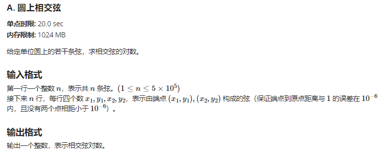
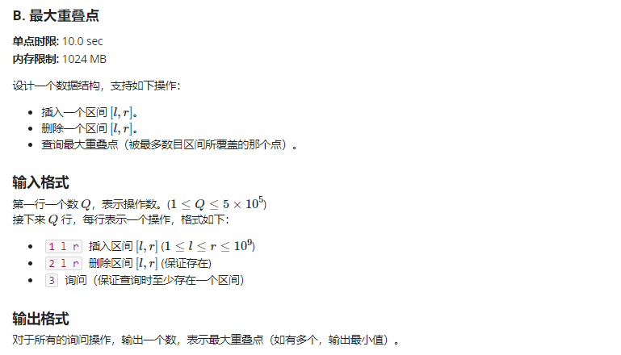
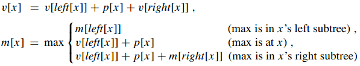

<div><font size="70"><center><b>第四次实验报告</b></center></font></div>

## Q1

### Description



### Solution

先对四个端点进行处理，转化成弧度制，则一条弦由两个弧度表示（r1，r2）

则弦相交转化为（设弦一为(r1,r2)，弦二为(r3,r4) 并且r2<r4），

<center><b> r1 < r3 < r2 < r4 </b></center>

故而对于2n个端点，我们先进行排序，

从左到右遍历，若该端点为左端点，则插入红黑树，

若为右端点<b>R1</b>，则寻找对应左端点<b>L1</b>，查找位于左右两个端点中间的左端点数目<b>ans</b>，然后在红黑树中删除<b>L1</b>结点，避免出现 大区间套小区间 也被当做相交的情况出现。

最终结果即为

<center><b>sum = Σ ans</b></center>

### Code

#### main

```c++
#include <iostream>
#include <map>
#include <cmath>
#include <algorithm>
using namespace std;
const int MAXN = 5e5 + 10;

typedef struct point{
    double key;
    bool isRight;
    double startkey;
} POINT;

POINT ps[MAXN * 2];

bool cmp(POINT a, POINT b)
{
    return a.key < b.key;
}

int main()
{
    int N;
    cin >> N;
    double x1, x2, y1, y2;
    for (int i = 0; i < N; i++)
    {
        cin >> x1 >> y1 >> x2 >> y2;
        double res1 = atan2(y1, x1);
        double res2 = atan2(y2, x2);
        if (res1 > res2)
        {
            ps[i * 2].key = res1;
            ps[i * 2].isRight = true;
            ps[i * 2].startkey = res2;
            ps[i * 2 + 1].key = res2;
            ps[i * 2 + 1].isRight = false;
        } else {
            ps[i * 2].key = res2;
            ps[i * 2].isRight = true;
            ps[i * 2].startkey = res1;
            ps[i * 2 + 1].key = res1;
            ps[i * 2 + 1].isRight = false;
        }
    }
    sort(ps, ps + 2 * N, cmp);

    // for (int i = 0; i < 2 * N; i++)
    //     cout << ps[i].key << endl;

    long long ans = 0;
    RBTree rbtree;
    
    for (int i = 0; i < 2 * N; i++)
    {
        if (ps[i].isRight) // 若当前值为右端点值
        {
            double lkey = ps[i].startkey;
            int n = smallnum(rbtree.Root(), lkey); // 查找rbtree中小于lkey的结点个数
            
            ans += rbtree.Root()->size - n - 1; // 由于是按端点值递增的顺序查找，故当前树中结点的值必然小于 当前右端点值
            
            NODE *l = search(rbtree.Root(), lkey);
            //cout << lkey << " " << ps[i].key << endl;
            // cout << l->key << endl;
            // cout << m << " " <<  n << endl;
            rbtree.RBdelete(l);
        } else {
            rbtree.insert(ps[i].key);
        }
        // midorder(rbtree.Root());
        // cout << endl;
    }
    cout << ans << endl;
}
```

#### RBTree

```c++
#include <iostream>
#include <map>
#include <cmath>
#include <algorithm>
using namespace std;
const int MAXN = 5e5 + 10;

typedef struct node
{
    double key;
    int size;
    struct node *lchild, *rchild, *parent;
    bool isRed;
} NODE;

void leftRotate(NODE *&, NODE *);
void rightRotate(NODE *&, NODE *);
void RB_insert(NODE *&, NODE *);
void RB_delete(NODE *&, NODE *);
void RB_insert_fixup(NODE *&, NODE *);
void removeFixUp(NODE *&, NODE *, NODE *);
int size_update(NODE *);
NODE *search(NODE *, double);
void midorder(NODE *t);

void midorder(NODE *t)
{
    if (t == NULL)
        return;
    midorder(t->lchild);
    cout << t->key << " " << t->size << endl;
    midorder(t->rchild);
}

int smallnum(NODE *tr, double k)
{
    if (tr == NULL)
        return 0;
    NODE *p = tr;
    int sum = 0;
    while (p != NULL)
    {
        if (fabs(k - p->key) < 1e-6)
        {
            if (p->lchild != NULL)
                sum += p->lchild->size;
            break;
        }
        else if (k < p->key)
        {
            p = p->lchild;
        }
        else if (k > p->key)
        {
            sum += p->size;
            p = p->rchild;
            if (p != NULL)
                sum -= p->size;
        }
    }
    return sum;
}

int size_update(NODE *tr)
{
    if (tr == NULL)
        return 0;
    tr->size = size_update(tr->lchild) + size_update(tr->rchild) + 1;
    return tr->size;
}

NODE* search(NODE* tr, double k)
{
    if (tr == NULL)
        return NULL;
    NODE *p = tr;
    while (p != NULL && fabs(k - p->key) >= 1e-6)
    {
        if (k > p->key)
            p = p->rchild;
        else
            p = p->lchild;
    }
    return p;
}

void leftRotate(NODE* &tr, NODE *x)
{
    if (x->rchild == NULL)
        return;
    NODE *y = x->rchild;
    int ysize = y->size;
    y->size = x->size;
    x->size -= ysize;

    x->rchild = y->lchild;
    if (y->lchild != NULL)
    {
        y->lchild->parent = x;
        x->size += y->lchild->size;
    }
    y->parent = x->parent;
    if (x->parent == NULL)
        tr = y;
    else if (x == x->parent->lchild)
        x->parent->lchild = y;
    else if (x == x->parent->rchild)
        x->parent->rchild = y;
    y->lchild = x;
    x->parent = y;
    return;
}

void rightRotate(NODE* &tr, NODE *y)
{
    if (y->lchild == NULL)
        return;
    NODE *x = y->lchild;
    int xsize = x->size;
    x->size = y->size;
    y->size -= xsize;

    y->lchild = x->rchild;
    if (x->rchild != NULL)
    {
        x->rchild->parent = y;
        y->size += x->rchild->size;
    }
    x->parent = y->parent;
    if (y->parent == NULL)
        tr = x;
    else if (y == y->parent->lchild)
        y->parent->lchild = x;
    else if (y == y->parent->rchild)
        y->parent->rchild = x;
    x->rchild = y;
    y->parent = x;
}

void RB_insert(NODE* &tr, NODE *z)
{
    NODE *x = tr;
    NODE *y = NULL;
    while (x != NULL)
    {
        y = x;
        if (z->key < x->key)
            x = x->lchild;
        else
            x = x->rchild;
        y->size += 1;
    }
    z->parent = y;
    if (y == NULL)
        tr = z;
    else if (z->key < y->key)
        y->lchild = z;
    else
        y->rchild = z;
    z->lchild = z->rchild = NULL;
    z->isRed = true;
    RB_insert_fixup(tr, z);
    
    return;
}

void RB_insert_fixup(NODE* &tr, NODE *z1)
{
    NODE *z = z1;
    NODE *y = NULL;
    while (z->parent != NULL && z->parent->isRed == true)
    {
        if (z->parent == z->parent->parent->lchild)
        {
            y = z->parent->parent->rchild;
            // case 1: 叔父结点均为红色
            if (y != NULL && y->isRed == true)
            {
                z->parent->isRed = false;
                y->isRed = false;
                z->parent->parent->isRed = true;
                z = z->parent->parent;
            }
            // case 2: 叔结点为黑色
            else 
            {
                // case 2: 当前节点为右孩子
                if (z == z->parent->rchild)
                {
                    z = z->parent;
                    leftRotate(tr, z);
                } 
                // case 3: 当前节点为左孩子
                else 
                {
                    z->parent->isRed = false;
                    z->parent->parent->isRed = true;
                    rightRotate(tr, z->parent->parent);
                }
            }
        } else {
            y = z->parent->parent->lchild;
            // case 1: 叔父结点均为红色
            if (y != NULL && y->isRed == true)
            {
                z->parent->isRed = false;
                y->isRed = false;
                z->parent->parent->isRed = true;
                z = z->parent->parent;
            }
            // case 2: 叔结点为黑色
            else 
            {
                // case 2: 当前节点为左孩子
                if (z == z->parent->lchild)
                {
                    z = z->parent;
                    rightRotate(tr, z);
                } 
                // case 3: 当前节点为右孩子
                else 
                {
                    z->parent->isRed = false;
                    z->parent->parent->isRed = true;
                    leftRotate(tr, z->parent->parent);
                }
            }
        }
    }
    tr->isRed = false;
    return;
}

void RB_delete(NODE* &tr, NODE *node)
{
    NODE *child, *parent;
    bool color;
    if (node->lchild != NULL && node->rchild != NULL)
    {
        NODE *replace = node;
        replace = replace->rchild;
        while (replace->lchild != NULL)
        {
            replace = replace->lchild;
        }

        NODE *p = replace->parent;
        while (p != NULL)
        {
            p->size -= 1;
            p = p->parent;
        }

        if (node->parent != NULL)
        {
            if (node->parent->lchild == node)
                node->parent->lchild = replace;
            else
                node->parent->rchild = replace;
        }
        else
            tr = replace;

        child = replace->rchild;
        parent = replace->parent;
        color = replace->isRed;

        if (parent == node)
            parent = replace;
        else
        {
            if (child != NULL)
                child->parent = parent;
            parent->lchild = child;

            replace->rchild = node->rchild;
            node->rchild->parent = replace;
        }

        replace->parent = node->parent;
        replace->isRed = node->isRed;
        replace->lchild = node->lchild;
        node->lchild->parent = replace;

        replace->size = replace->lchild->size + 1;
        if (replace->rchild != NULL)
            replace->size += replace->rchild->size;

        if (color == false)
            removeFixUp(tr, child, parent);
        
        delete node;
        return;
    }

    if (node->lchild != NULL)
        child = node->lchild;
    else
        child = node->rchild;

    parent = node->parent;
    color = node->isRed;

    if (child != NULL)
    {
        child->parent = parent;
        // NODE *p = parent;
        // while (p != NULL)
        // {
        //     p->size -= 1;
        //     p = p->parent;
        // }
    }
    
    if (parent != NULL)
    {
        if (parent->lchild == node)
            parent->lchild = child;
        else
            parent->rchild = child;
        NODE *p = parent;
        while (p != NULL)
        {
            p->size -= 1;
            p = p->parent;
        }
    }
    else
        tr = child;

    if (color == false)
        removeFixUp(tr, child, parent);

    // if (parent == NULL)
    //     size_update(tr);
    // else
    // {
    //     size_update(parent);
    //     NODE *p = parent->parent;
    //     while(p != NULL)
    //     {
    //         p->size -= 1;
    //         p = p->parent;
    //     }
    // }

    delete node;
}

void removeFixUp(NODE* &tr, NODE* node, NODE* parent)
{
    NODE *other;

    while ((node == NULL || node->isRed == false) && node != tr)
    {
        if (parent->lchild == node)
        {
            other = parent->rchild;
            if (other->isRed == true)
            {
                other->isRed = false;
                parent->isRed = true;
                leftRotate(tr, parent);
                other = parent->rchild;
            }
            if ((other->lchild == NULL || other->lchild->isRed == false) && (other->rchild == NULL || other->rchild->isRed == false))
            {
                other->isRed = true;
                node = parent;
                parent = node->parent;
            }
            else
            {
                if (other->rchild == NULL || other->rchild->isRed == false)
                {
                    other->lchild->isRed = false;
                    other->isRed = true;
                    rightRotate(tr, other);
                    other = parent->rchild;
                }
                other->isRed = parent->isRed;
                parent->isRed = false;
                other->rchild->isRed = false;
                leftRotate(tr, parent);
                node = tr;
                break;
            }
        }
        else
        {
            other = parent->lchild;
            if (other->isRed == true)
            {
                other->isRed = false;
                parent->isRed = true;
                rightRotate(tr, parent);
                other = parent->lchild;
            }
            if ((other->lchild == NULL || other->lchild->isRed == false) && (other->rchild == NULL || other->rchild->isRed == false))
            {
                other->isRed = true;
                node = parent;
                parent = node->parent;
            }
            else
            {
                if (other->lchild == NULL || other->lchild->isRed == false)
                {
                    other->rchild->isRed = false;
                    other->isRed = true;
                    leftRotate(tr, other);
                    other = parent->lchild;
                }
                other->isRed = parent->isRed;
                parent->isRed = false;
                other->lchild->isRed = false;
                rightRotate(tr, parent);
                node = tr;
                break;
            }
        }
    }
    if (node != NULL)
        node->isRed = false;
}

class RBTree{
private:
    NODE *root;
public:
    RBTree();
    ~RBTree();

    NODE *Root();
    void insert(NODE *);
    void insert(double);
    void RBdelete(NODE *);
    void destroy(NODE *&);
};


void RBTree::insert(NODE *z)
{
    RB_insert(root, z);
}

void RBTree::insert(double x)
{
    NODE *p = new NODE;
    p->lchild = p->rchild = p->parent = NULL;
    p->key = x;
    p->size = 1;
    p->isRed = true;
    RB_insert(root, p);
}

void RBTree::RBdelete(NODE *z)
{
    RB_delete(root, z);
}

RBTree::RBTree()
{
    root = NULL;
}

RBTree::~RBTree()
{
    this->destroy(root);
}

NODE* RBTree::Root()
{
    return root;
}

void RBTree::destroy(NODE* &tree)
{
    if (tree == NULL)
        return;

    if (tree->lchild != NULL)
        destroy(tree->lchild);
    if (tree->rchild != NULL)
        destroy(tree->rchild);

    delete tree;
    tree = NULL;
}
```

## Q2

### Description



### Solution

设有n个区间，将所有2n个点从小到大排序，对于排序后的第i个点，若它是某个区间的左端点，则p[i]=1，若它是某个区间的右端点，则p[i]=-1。若一个端点是排序后的第i个点，则有个SUM(p[1],p[i])个区间覆盖这个点。

使用红黑树对所有的端点进行动态排序并保证有较好的性质，在树的结点中增加一些顺序统计量的信息，用于求SUM(p[1],p[i])

步骤1：基础数据结构

红黑树，p[x]=1表示它是区间的左端点，p[x]=-1表示它是区间的右端点

步骤2：附加信息

v[x]：以x为根的所有结点的p值之和

m[x]：以x为根的所有结点的v值的最大值

o[x]：以x为根的所有结点中的最大覆盖点

步骤3：对信息的维护



##### PS：对于同一key值的左右端点，要分开来统计。

### Code

#### main

```c++
int main()
{
    nilInit();
    int N, op, le, ri;
    cin >> N;
    RBTree tr;
    for (int i = 0; i < N; i++)
    {
        cin >> op;
        if (op == 3)
        {
            cout << tr.Root()->o << endl;
        } 
        else if (op == 1)
        {
            cin >> le >> ri;
            NODE *p = search(tr.Root(), le, 1);
            if (p != nil)
            {
                p->p++;
                updateVOM(p);
            } else {
                tr.insert(le, 1);
            }
            p = search(tr.Root(), ri, -1);
            //cout << p->key << p->p << p->m << p->o << endl;
            if (p != nil)
            {
                p->p--;
            while (p != nil)
            {
                updateVOM(p);
                p = p->parent;
            }
            } else {
                tr.insert(ri, -1);
            }
        } 
        else
        {
            cin >> le >> ri;
            NODE *p = search(tr.Root(), le, 1);
            p->p--;
            while (p != nil)
            {
                updateVOM(p);
                p = p->parent;
            }
            // if (p->p == 0)
            //     tr.rbDelete(p);
                

            p = search(tr.Root(), ri, -1);
            //cout << p->key << p->p << p->m << p->o << endl;
            p->p++;

            while (p != nil)
            {
                updateVOM(p);
                p = p->parent;
            }
            // if (p->p == 0)
            //     tr.rbDelete(p)
        }
        // midorder(tr.Root());
        // cout << endl;
    }
}
```

#### RBTree

```c++
#include <iostream>
using namespace std;

typedef struct node
{
    int key;
    int p;
    int m;
    int v;
    int o;
    struct node *left, *right, *parent;
    bool isRed;
} NODE;

NODE *nil = new NODE;

void leftRotate(NODE *&, NODE *);
void rightRotate(NODE *&, NODE *);
void RB_insert(NODE *&, NODE *);
void RB_delete(NODE *&, NODE *);
void RB_insert_fixup(NODE *&, NODE *);
void removeFixUp(NODE *&, NODE *, NODE *);
NODE *serach(NODE *, int, int);

void nilInit()
{
    nil->isRed = false;
    nil->key = 0;
    nil->left = nil->right = nil->parent = NULL;
    nil->p = nil->v = nil->m = nil->o = 0;
}

int max(int a,int b,int c)  
{  
    if(a>=b && a>=c)  
        return a;  
    else if(b>=c)  
        return b;  
    else  
        return c;  
}  

// void updateVOM(node *x)  
// {  
//     while(x != nil)  
//     {  
//         x->v = x->left->v + x->p + x->right->v;  
//         x->m = max(x->left->m,  
//             x->left->v + x->p,  
//             x->left->v + x->p + x->right->m);
//         if(x->m == x->left->v + x->p + x->right->m)  
//             x->o = x->right->o;  
//         if(x->m == x->left->v + x->p)  
//             x->o = x->key; 
//         if(x->m == x->left->m)  
//             x->o = x->left->o;  
//         x = x->parent;  
//     }  
// }  

void updateVOM(NODE* z)
{
    z->v = z->p + z->left->v + z->right->v;
    z->m = max(z->left->m, z->left->v + z->p, z->left->v + z->p + z->right->m);
    if (z->m == z->left->v + z->p + z->right->m)
        z->o = z->right->o;
    if (z->m == z->left->v + z->p)
        z->o = z->key;
    if (z->m == z->left->m)
        z->o = z->left->o;
}

NODE *search(NODE *tr, int key, int left)
{
    NODE *p = tr;
    while (p != nil)
    {
        if (p->key < key)
            p = p->right;
        else if (p->key > key)
            p = p->left;
        else
        {
            if (left > 0)
            {
                if (p->p > 0)
                    return p;
                else
                    p = p->left;
            }
            else if (left < 0)
            {
                if (p->p < 0)
                    return p;
                else
                    p = p->right;
            }
        }
    }
    return p;
}

void leftRotate(NODE* &tr, NODE *x)
{
    if (x->right == nil)
        return;
    NODE *y = x->right;
    x->right = y->left;
    if (y->left != nil)
        y->left->parent = x;
    y->parent = x->parent;
    if (x->parent == nil)
        tr = y;
    else if (x == x->parent->left)
        x->parent->left = y;
    else if (x == x->parent->right)
        x->parent->right = y;
    y->left = x;
    x->parent = y;

    updateVOM(x);
    updateVOM(y);
    return;
}

void rightRotate(NODE* &tr, NODE *y)
{
    if (y->left == nil)
        return;
    NODE *x = y->left;
    y->left = x->right;
    if (x->right != nil)
        x->right->parent = y;
    x->parent = y->parent;
    if (y->parent == nil)
        tr = x;
    else if (y == y->parent->left)
        y->parent->left = x;
    else if (y == y->parent->right)
        y->parent->right = x;
    x->right = y;
    y->parent = x;

    updateVOM(y);
    updateVOM(x);
}

void RB_insert(NODE* &tr, NODE *z)
{
    NODE *x = tr;
    NODE *y = nil;
    while (x != nil)
    {
        y = x;
        if (z->key < x->key)
            x = x->left;
        else if (z->key > x->key)
            x = x->right;
        else
        {
            if (z->p < x->p)
                x = x->right;
            else if (z->p > x->p)
                x = x->left;
        }
    }
    z->parent = y;
    if (y == nil)
        tr = z;
    else if (z->key < y->key)
        y->left = z;
    else if (z->key > y->key)
        y->right = z;
    else
    {
        if (z->p < y->p)
            y->right = z;
        else
            y->left = z;
    }
        
    z->left = z->right = nil;
    z->isRed = true;

    RB_insert_fixup(tr, z);

    NODE *p = z;
    while (p != nil)
    {
        updateVOM(p);
        p = p->parent;
    }
    // updateVOM(z);
    return;
}

void RB_insert_fixup(NODE* &tr, NODE *z1)
{
    NODE *z = z1;
    NODE *y = nil;
    while (z->parent != nil && z->parent->isRed == true)
    {
        if (z->parent == z->parent->parent->left)
        {
            y = z->parent->parent->right;
            // case 1: 叔父结点均为红色
            if (y != nil && y->isRed == true)
            {
                z->parent->isRed = false;
                y->isRed = false;
                z->parent->parent->isRed = true;
                z = z->parent->parent;
            }
            // case 2: 叔结点为黑色
            else 
            {
                // case 2: 当前节点为右孩子
                if (z == z->parent->right)
                {
                    z = z->parent;
                    leftRotate(tr, z);
                } 
                // case 3: 当前节点为左孩子
                else 
                {
                    z->parent->isRed = false;
                    z->parent->parent->isRed = true;
                    rightRotate(tr, z->parent->parent);
                }
            }
        } else {
            y = z->parent->parent->left;
            // case 1: 叔父结点均为红色
            if (y != nil && y->isRed == true)
            {
                z->parent->isRed = false;
                y->isRed = false;
                z->parent->parent->isRed = true;
                z = z->parent->parent;
            }
            // case 2: 叔结点为黑色
            else 
            {
                // case 2: 当前节点为左孩子
                if (z == z->parent->left)
                {
                    z = z->parent;
                    rightRotate(tr, z);
                } 
                // case 3: 当前节点为右孩子
                else 
                {
                    z->parent->isRed = false;
                    z->parent->parent->isRed = true;
                    leftRotate(tr, z->parent->parent);
                }
            }
        }
    }
    tr->isRed = false;
    return;
}

void RB_delete(NODE* &tr, NODE *node)
{
    NODE *child, *parent;
    bool color;
    if ((node->left != nil) && (node->right != nil))
    {
        NODE *replace = node;
        replace = replace->right;
        while (replace->left != nil)
            replace = replace->left;
        
        if (node->parent != nil)
        {
            if (node->parent->left == node)
                node->parent->left = replace;
            else
                node->parent->right = replace;
        }
        else
            tr = replace;

        child = replace->right;
        parent = replace->parent;
        color = replace->isRed;

        if (parent == node)
            parent = replace;
        else
        {
            if (child != nil)
                child->parent = parent;
            parent->left = child;

            replace->right = node->right;
            node->right->parent = replace;
        }

        replace->parent = node->parent;
        replace->isRed = node->isRed;
        replace->left = node->left;
        node->left->parent = replace;

        if (color == false)
            removeFixUp(tr, child, parent);

        delete node;
        return;
    }

    if (node->left != nil)
        child = node->left;
    else
        child = node->right;

    parent = node->parent;
    color = node->isRed;

    if (child != nil)
        child->parent = parent;
    
    if (parent != nil)
    {
        if (parent->left == node)
            parent->left = child;
        else
            parent->right = child;
    }
    else
        tr = child;

    if (color == false)
        removeFixUp(tr, child, parent);
    delete node;
}

void removeFixUp(NODE* &tr, NODE* node, NODE* parent)
{
    NODE *other;

    while (node->isRed == false && node != tr)
    {
        if (parent->left == node)
        {
            other = parent->right;
            if (other->isRed == true)
            {
                other->isRed = false;
                parent->isRed = true;
                leftRotate(tr, parent);
                other = parent->right;
            }
            if ((other->left == nil || other->left->isRed == false) && (other->right == nil || other->right->isRed == false))
            {
                other->isRed = true;
                node = parent;
                parent = node->parent;
            }
            else
            {
                if (other->right == nil || other->right->isRed == false)
                {
                    other->left->isRed = false;
                    other->isRed = true;
                    rightRotate(tr, other);
                    other = parent->right;
                }
                other->isRed = parent->isRed;
                parent->isRed = false;
                other->right->isRed = false;
                leftRotate(tr, parent);
                node = tr;
                break;
            }
        }
        else
        {
            other = parent->left;
            if (other->isRed == true)
            {
                other->isRed = false;
                parent->isRed = true;
                rightRotate(tr, parent);
                other = parent->left;
            }
            if ((other->left == nil || other->left->isRed == false) && (other->right == nil || other->right->isRed == false))
            {
                other->isRed = true;
                node = parent;
                parent = node->parent;
            }
            else
            {
                if (other->left == nil || other->left->isRed == false)
                {
                    other->right->isRed = false;
                    other->isRed = true;
                    leftRotate(tr, other);
                    other = parent->left;
                }
                other->isRed = parent->isRed;
                parent->isRed = false;
                other->left->isRed = false;
                rightRotate(tr, parent);
                node = tr;
                break;
            }
        }
    }
    updateVOM(node);
    // NODE *p = node;
    // while (p != nil)
    // {
    //     updateVOM(p);
    //     p = p->parent;
    // }
    node->isRed = false;
}

class RBTree{
private:
    NODE *root;
public:
    RBTree();
    ~RBTree();

    NODE *Root();
    void insert(NODE *);
    void insert(int key, int left);
    void rbDelete(NODE *);
    void destroy(NODE *&);

};

void RBTree::rbDelete(NODE *z)
{
    RB_delete(root, z);
}

void RBTree::insert(int key, int left)
{
    NODE *p = new NODE;
    p->isRed = true;
    p->left = p->right = p->parent = nil;
    p->m = 0;
    p->o = key;
    p->key = key;
    p->v = p->p = left;
    RB_insert(root, p);
}

void RBTree::insert(NODE *z)
{
    RB_insert(root, z);
}

RBTree::RBTree()
{
    root = nil;
}

RBTree::~RBTree()
{
    this->destroy(root);
}

NODE* RBTree::Root()
{
    return root;
}

void RBTree::destroy(NODE* &tree)
{
    if (tree == nil)
        return;

    if (tree->left != nil)
        destroy(tree->left);
    if (tree->right != nil)
        destroy(tree->right);

    delete tree;
    tree = nil;
}

void midorder(NODE *t)
{
    if (t == nil)
        return;
    midorder(t->left);
    cout << t->key << " " << t->p << " " << t->v << " " << t->m << " " << t->o <<endl;
    midorder(t->right);
}
```


