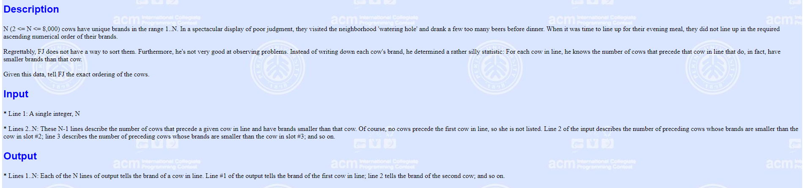
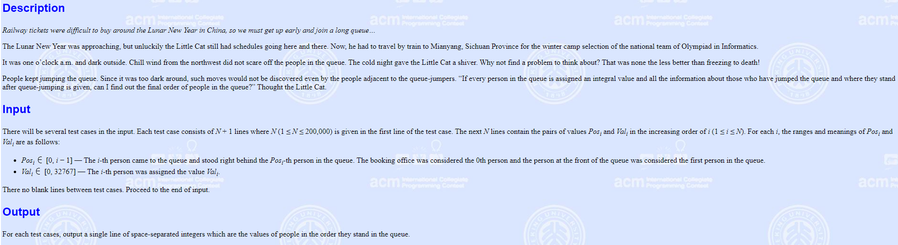
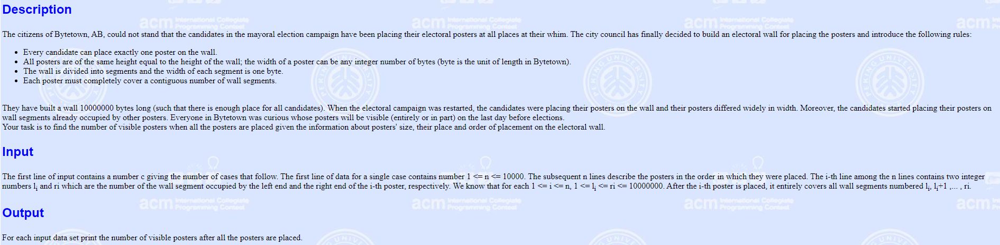

<div><center><font size="70"><b>第五次实验报告</b></font><center></div>

## Q1(POJ2182)

### Description



### Solution

从后往前倒着做，我们发现可以唯一确定每只牛的号牌，如样例：

input：5 1 2 1 0

我们用<b>b</b>数组表示当前牛的编号

则现在有五个编号，置一数组表示

<b>a</b>：1 1 1 1 1（1表示还未选过此号牌）


读入0，则选取第一个号牌，则

<b>b</b>：x x x x 1

同时，1号牌被选中，a1置零

<b>a</b>：0 1 1 1 1


读入1，则选取还未被选取的第二个号牌

<b>b</b>：x x x 3 1

<b>a</b>：0 1 0 1 1

依此类推

最终：

<b>b</b>：2 5 4 3 1

<b>a</b>：0 0 0 0 0


我们选用树状数组去维护<b>a</b>数组，同时用二分查找查找当前未被选取的第<b>i</b>个号牌

### Code

#### main.cpp

```c+
#include <iostream>
using namespace std;
const int MAXN = 1e5 + 10;
int c[MAXN], a[MAXN], b[MAXN], N;

void add(int x, int val)
{
    while (x <= N)
    {
        c[x] += val;
        x += x & (-x);
    }
}

int getsum(int x)
{
    int sum = 0;
    while (x > 0)
    {
        sum += c[x];
        x -= x & (-x);
    }
    return sum;
}

int find(int x)
{
    int l = 1, r = N;
    int p = 0;
    int mid;
    while (l <= r)
    {
        mid = (l + r) / 2;
        if (getsum(mid) >= x)
        {
            p = mid;
            r = mid - 1;
        }
        else 
            l = mid + 1;
    }
    return p;
}

int main()
{
    cin >> N;
    int k;
    a[0] = N;
    for (int i = 1; i < N; i++)
    {
        cin >> k;
        a[i] = k;
    }
    for (int i = 1; i <= N; i++)
    {
        add(i, 1);
    }

    int pos;
    for (int i = N - 1; i > 0; i--)
    {
        pos = find(a[i] + 1);
        b[i] = pos;
        add(pos, -1);
    }
    pos = find(1);
    b[0] = pos;

    for (int i = 0; i < N; i++)
        cout << b[i] << endl;
}
```

## Q2(POJ2828)

### Description



### Solution

解题思路同第一题，倒着做，用树状数组维护，并用二分查询

### Code

#### main.cpp

```c++
#include <iostream>
#include <cstring>
using namespace std;
const int MAXN = 2e5 + 10;
int c[MAXN], ran[MAXN], N;

typedef struct person{
    int jq;
    int key;
} PER;

PER ps[MAXN];

void add(int x, int val)
{
    while (x <= N)
    {
        c[x] += val;
        x += x & (-x);
    }
}

int getsum(int x)
{
    int s = 0;
    while (x > 0)
    {
        s += c[x];
        x -= x & (-x);
    }
    return s;
}

int find(int x)
{
    int l = 1, r = N;
    int p = 0, mid;
    while (l <= r)
    {
        mid = (l + r) / 2;
        if (mid - getsum(mid) >= x)
        {
            p = mid;
            r = mid - 1;
        } 
        else
        {
            l = mid + 1;
        }
    }
    return p;
}

int main()
{
    while (scanf("%d", &N) != EOF)
    {
        memset(c, 0, sizeof(c));

        for (int i = 0; i < N; i++)
            scanf("%d%d", ps[i].jq, ps[i].key);

        int pos;
        for (int i = N - 1; i >= 0; i--)
        {
            pos = find(ps[i].jq + 1);
            ran[pos - 1] = ps[i].key;
            add(pos, 1);
        }

        for (int i = 0; i < N; i++)
            cout << ran[i] << " ";
        cout << endl;
    }
}
```

## Q3(POJ2528)

### Description



### Solution

### Code

## Q4(POJ2155)

### Description

### Solution

### Code

