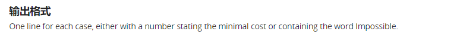

<center><font size="70"><b>第六次实验报告</b></font></center>

## Q1

### Description


#### Input


#### Output


#### Example


### Solution

这一题采用dfs的方式，主要有两个限制

1、加数的个数要最少（故而我们从两个加数开始搜索，如果两个加数没有解，那么搜索三个加数的情况，直到出现第一个可行解，第一个可行解的加数即是最少的加数）

2、最后一个加数的分母要尽可能小（这一条为我们搜索最优解提供约束）


开始搜索：

假设现在在<b>**k**</b>个加数这一个领域里搜索，并且已经搜索到了第<b>i</b>个加数（还剩<b>k-i+1</b>个加数未确定）

剩余的真分数（即原分数减去前面**i-1**个加数后剩余的部分）分子为**x**，分母为**y**

第**i**个加数的搜索限制具体为：

1、**y<sub>i</sub>**（第i个加数的分母）> **y<sub>i-1</sub>** 

2、**(k-i+1) / y<sub>i</sub> > x / y** (后面的加数只会比第**i**个加数更小)

3、**1 / y<sub>i</sub> < x / y**

更进一步优化有：

1、**1 / y<sub>i</sub> > 1 / ans<sub>k</sub>** (已经搜索到可行解的情况下)

2、将正向搜索改为逆向搜索（采用**y<sub>i</sub>**递增的方式搜索改为**y<sub>i</sub>**递减的方式搜索）


递归终止条件为：**k == i**

若最终**x<sub>k</sub>** == 1, 即搜索到一个可行解

与暂存的可行解进行比较，最终得出最优解


### Code

#### main.cpp

```c++
#include <iostream>
#include <ctime>
using namespace std;
const int MAXN = 110;

long long a, b, anss, t;
long long ans[MAXN];
long long s[MAXN];

long long gcd(long long a, long long b)
{
    if (a > b)
        return gcd(a % b, b);
    if (a == 0)
        return b;
    return gcd(b % a, a);
}

bool dfs(long long k, long long x, long long y)
{
    if (x > y)
    {
        return dfs(k, y, x);
    }
    if (k == 1)
    {
        // if (x == 1)
        // {        
        //     for (long long i = 1; i <= t; i++)
        //     {
        //         cout << s[i] << " ";
        //     }
        //     cout << y << endl;
        // }

        // cerr << "wrong" << endl;
        if (x == 1 && y > s[t] && (anss == 0 || y < ans[anss]))
        {
            anss = ++t;
            s[t] = y;
            for (long long i = 1; i <= t; i++)
                ans[i] = s[i];
            t--;
            return true;
        }
        return false;
    }

    bool getans = false;

    long long s1 = s[t] + 1;
    long long s2 = y / x + 1; 
    //cerr << "wrong" << x << " " << y << endl;
    long long imax = k * y / x;
    if (ans[anss] != 0 && ans[anss] < imax)
        imax = ans[anss];
    long long im = s1 > s2 ? s1 : s2;
    for (long long i = imax; i >= im; i--)
    {
        // if (ans[anss] != 0 && i >= ans[anss])
        //     break;
        long long yy = y * i;
        long long xx = x * i - y;
        long long gg = gcd(xx, yy);
        xx /= gg;
        yy /= gg;
        s[++t] = i;
        if (dfs(k-1, xx, yy))
            getans = true;
        t--;
        // cerr << "wrong" << endl;
    }
    return getans;
}

int main()
{
    clock_t start, end;

    
    cin >> b >> a;
    start = clock();
    long long gd = gcd(a, b);
    if (gd != 1)
    {
        b /= gd;
        a /= gd;
    }
    if (b == 1)
    {
        cout << a << endl;
        return 0;
    }


    for (long long i = 2; i <=MAXN ;i++)
    {
        t = 0;
        anss = 0;
        // cout << "wrong" << endl;
        if (dfs(i, b, a))
        {
            for (long long i = 1; i <= anss; i++)
                cout << ans[i] << " ";
            cout << endl;

            end = clock();
             cout << "The run time is: " <<(double)(end - start) / CLOCKS_PER_SEC << "s" << endl;

            return 0;
        }
        //cout << i << endl;
    }

}
```

## Q2

### Description


#### Input


#### Output



#### Example


### Solution

题目大致意思就是：从某个四位数质数号牌的房间到另一个四位数质数号牌的房间，搜索一条最短的质数路径，每一次转移，只能到同为质数号牌的房间，并且每次号牌只改变一位数字，

简单的bfs即可，用haveIn数组表示是否已经将经由这个房间的路径加入进队列中，

### Code

#### main.cpp

```c++
#include <iostream>
#include <queue>
using namespace std;
const int MAXN = 1e5 + 10;
bool not_prime[MAXN];
int haveIn[MAXN];

void prime()
{
    not_prime[1] = 1;
    for (int i = 2; i * i <= MAXN;i++)
    {
        if(!not_prime[i])
        {
            for (int j = i * i; j <= MAXN; j+=i)
                not_prime[j] = 1;
        }
    }
}

int bfs(int src, int des)
{
    queue<int> st;
    st.push(src);
    haveIn[src] = 1;

    int s, s1;
    int rest1, rest2;
    int weight;
    while (!st.empty())
    {
        s = st.front();
        st.pop();
        // cout << s << endl;
        if (s == des)
            return haveIn[s];

        weight = 1000;
        
        for (; weight > 0; weight /= 10)
        {
            rest1 = s / (weight * 10);
            rest2 = s % weight;
            for (int i = 0; i < 10; i++)
            {
                s1 = rest1 * weight * 10 + weight * i + rest2;
                if (s1 >= 1000 && !not_prime[s1] && !haveIn[s1])
                {
                    st.push(s1);
                    haveIn[s1] = haveIn[s] + 1;
                }
            }
        }
    }
    return 0;
}

int main()
{
    prime();
    // cout << not_prime[8017] << endl;
    int N, a, b, ans;
    cin >> N;
    while (N--)
    {
        for (int i = 0; i < MAXN; i++)
            haveIn[i] = 0;
        cin >> a >> b;
        ans = bfs(a, b);
        cout << ans - 1 << endl;
    }
}
```

